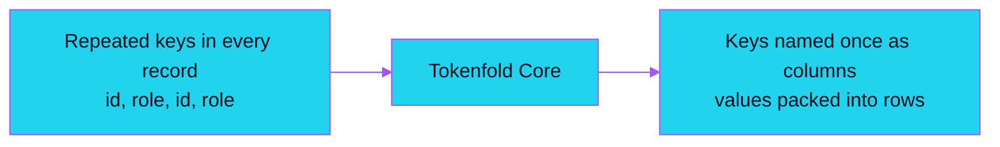
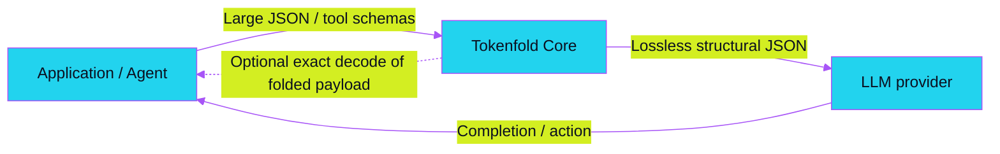
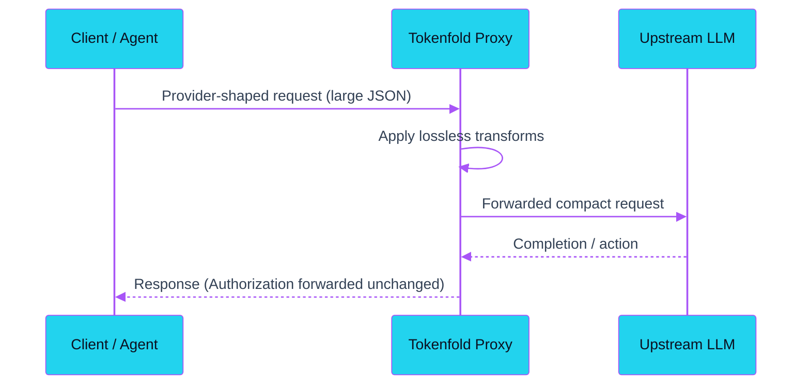

<div align="center">


<br />
<br />

# TOKENFOLD

<h3>More context. Fewer tokens. Exact by default.</h3>

<p>
  <strong>Save 45.6-67.6% on three bundled lossless JSON fixtures. An opt-in pruning showcase reaches 96.3% with omitted rows stored for retrieval.</strong>
</p>

<p><em>Model-free core. No model, no semantic rewriting; lossless transforms verify exact data recovery. Provider-neutral.</em></p>

<br />

<!-- Badges -->

[](https://github.com/snchimata/tokenfold/actions/workflows/ci.yml) [](https://pypi.org/project/tokenfold/) [](https://www.npmjs.com/package/tokenfold) [](https://docs.rs/crate/tokenfold-core/latest) [](https://github.com/snchimata/tokenfold/blob/main/LICENSE)

</div>

## Table of contents

- [Installation](#installation)
- [How it works](#how-it-works)
- [Quick start](#quick-start)
- [MCP & agents](#coding-agents-and-mcp-integration)
- [Core](#tokenfold-core)
- [Benchmarks](#measured-results)
- [Extended tooling](#extended-tooling)
- [Safety and auditability](#safety-and-auditability)
- [Reproduce the results](#reproduce-the-results)
- [Contributing](#contributing)
- [License](#license)

<br />

## Installation

```bash
pip install tokenfold        # Python library
npm install tokenfold        # Node.js / TypeScript library
cargo install tokenfold-cli  # Standalone CLI
cargo add tokenfold-core     # Rust library
```

<table>
  <tr>
    <td align="center" width="33%">
      <br />
      <strong>Up to 96.3% fewer tokens (showcase)</strong>
      <br /><br />
      Opt-in, recoverable pruning for heterogeneous array feeds - every dropped row stays fetchable.
      <br /><br />
    </td>
    <td align="center" width="33%">
      <br />
      <strong>45.6-67.6% on three fixtures, lossless</strong>
      <br /><br />
      Reversible structural folding of repeated keys and columns on three bundled fixtures - verified by exact JSON-value recovery.
      <br /><br />
    </td>
    <td align="center" width="33%">
      <br />
      <strong>Model-free &amp; deterministic</strong>
      <br /><br />
      No GPU, no semantic guesswork, no model in the Core path. Validate folded payloads on your workload: exact decode proves data recovery, not unchanged model behavior. Provider-neutral by design.
      <br /><br />
    </td>
  </tr>
</table>

> [!NOTE]
> **Built for:** Developers and AI teams cutting latency and API costs on structured JSON, tool definitions, and RAG feeds. Exact decode proves data recovery, not unchanged downstream task accuracy - validate folded payloads with your representative workload. Ideal for applications sending large JSON tool payloads, tool-calling agent loops (Claude Code, Codex), and structured RAG feeds where token overhead drives latency and cost.

<br />

## How it works

### What the model sees

```json
// Input (conceptual illustration - 2 rows shown; small inputs like this
// pass through unchanged under the never-larger guard)
[{"id":1,"role":"admin"},{"id":2,"role":"member"}]

// Tokenfold output on larger uniform arrays -> still JSON
{"__tf_cols__":["id","role"],"__tf_rows__":[[1,"admin"],[2,"member"]]}
```



Send the folded JSON directly to the model: column names label each value's
position in every row. Decode only when your application needs the original
object shape again.

#### Why Tokenfold, not LLMLingua / prompt compressors?

- **Targets structured JSON, not prose.** Folds repeated keys and columns
  mechanically rather than using semantic guesswork.
- **Model-free and deterministic.** Zero models running in Core and zero GPU
  overhead. Exact decode proves data recovery, not unchanged model behavior.
- **Verified by exact decode.** Every lossless transform is verified by an
  in-memory round trip before emitting; lossy pruning is strictly opt-in and
  recoverable.

For tabular arrays, Tokenfold folds repeated keys into
header columns (`__tf_cols__`). No model runs in the Core engine, and every
lossless transform is verified by exact decode.

> [!NOTE]
> `schema_compaction` is not enabled by any preset. Unlike the default
> transforms, it truncates `examples` arrays and is not reversible.



#### How Tokenfold decides what to fold


<details>
<summary><strong>Text version (screen readers / no-image fallback)</strong></summary>

1. Incoming JSON payload arrives.
2. Tabular shape? Yes: fold repeated keys into columns. No (heterogeneous
   feed): continue only when lossy pruning is opted in (rank rows, store
   dropped rows locally).
3. Verify with an exact decode round trip.
4. Smaller than input? Yes: emit folded payload + receipt. No: keep compact
   JSON (never larger).

</details>

#### Proxy / agent round trip




<details>
<summary><strong>How this demo was generated (VHS tape)</strong></summary>

The [VHS tape](docs/tokenfold-demo.tape) runs `inspect`, `compress`, and
`decode` against the bundled API response, including the **63.9%** receipt.
Run `vhs docs/tokenfold-demo.tape` to regenerate the GIF; the tape requires
`tokenfold` on `PATH`.

</details>

| Workload | Type | Core mode | Savings |
| --- | --- | --- | --- |
| API responses | 30-record JSON payload | Lossless | **63.9% fewer tokens** |
| Tool schemas | OpenAI tool-schema fixture (Criterion bench) | Lossless | **45.6% fewer tokens** |
| Repetitive JSON | 50-record payload | Lossless | **67.6% fewer tokens** |

These figures use exact `o200k_base` counts in the balanced preset. Versioned
inputs and provenance live in [`tests/fixtures/readme_metrics.json`](tests/fixtures/readme_metrics.json).
[Recoverable pruning](#recoverable-lossy-pruning) is separate, opt-in extended tooling.

<br />

## Quick start

### Drop-in proxy for OpenAI-compatible clients

Start the local proxy once, then point an existing client at it. The proxy
forwards provider-shaped requests to your fixed upstream and applies Core's
lossless transforms before forwarding.

```bash
cargo install tokenfold-proxy
tokenfold-proxy --upstream https://api.openai.com
```

The proxy installs from source via Cargo and listens on `127.0.0.1:8787` by
default (`--bind`; use `--allow-non-loopback-bind` to change that). Only
chat-shaped JSON bodies (a non-empty `messages` array) are compressed on the
passthrough path; anything else forwards untouched. Non-`GET /livez|/readyz|/health`
requests forward upstream with the incoming path appended to `--upstream`, so
point OpenAI-shaped clients at `<bind>/v1`. Prebuilt, checksummed release
binaries are published for the CLI only; the proxy has no prebuilt binary.
SSE responses stream through unbuffered with a whole-exchange
`--upstream-timeout-secs` deadline.

```python
from openai import OpenAI

# Your client's Authorization header is forwarded to upstream unchanged -
# no credential reconfiguration needed.
client = OpenAI(base_url="http://127.0.0.1:8787/v1")
# Existing calls work unchanged: client.chat.completions.create(...)
```

Works out-of-the-box with any client or framework that accepts a custom base URL
(LangChain, LlamaIndex, LiteLLM, Instructor, or direct HTTP clients).

### Interfaces

| Interface | 1-line install / command | Primary use case |
| --- | --- | --- |
| Proxy | `cargo install tokenfold-proxy` | Existing OpenAI-compatible clients |
| CLI | `cargo install tokenfold-cli` | Files, stdin, and shell workflows |
| Python | `pip install tokenfold` | Application pipelines |
| TypeScript | `npm install tokenfold` | Node.js applications and automation |
| Rust | `cargo add tokenfold-core` | Native embedding |
| MCP | `tokenfold mcp serve` | Agents and editors |

For files and stdin, install the CLI with `cargo install tokenfold-cli` or use a
[checksummed GitHub Release](https://github.com/snchimata/tokenfold/releases/latest), then:

```bash
tokenfold inspect payload.json --format json
tokenfold compress payload.json --format json --output payload.compact.json
```

Upgrading from v0.4? The
[v0.4 -> v0.5 migration matrix](docs/migration-v0.4-to-v0.5.md) maps every
interface change (`--mode` -> `--preset`, the `--lossy-*` family ->
`--prune`/`--keep-ratio`/`--preserve`, removed redaction bypass, exit codes 7
and 8).

For direct Python calls, use the same Core engine and typed receipt:

```python
from tokenfold import InputFormat, compress

# Accepts raw JSON bytes or str (messages, tools, or schemas)
request_json_bytes = b'{"messages": [{"role": "user", "content": "hello"}]}'
result = compress(request_json_bytes, format=InputFormat.OPENAI_JSON)

# For standalone JSON records, use: format=InputFormat.JSON
compressed_payload = result.payload  # bytes
print(f"Saved {result.report.saved_tokens} tokens ({result.saved_pct():.1f}%)")
```

### Presets

| Preset | Behavior |
| --- | --- |
| `conservative` | Minification only; no restructuring of what the model sees. |
| `balanced` (default) | Minification plus reversible columnar folding (`json_field_fold`, `json_value_dict`, `log_field_fold`) on eligible formats. |
| `aggressive` | Same default transform set as `balanced` today. |

Provider message formats (`openai_json`, `anthropic_json`) never receive
columnar folding: only minification applies, so API shapes stay intact.

### Runnable examples (Python >=3.9, Node.js >=22, Rust >=1.98)

Runnable examples, one per surface, all under [`examples/`](examples):

```bash
python examples/quickstart.py      # Python: compress messages, request bodies, JSON data
node examples/quickstart.mjs       # TypeScript/Node: compress, inspect, read the receipt
cargo run -p tokenfold-core --example quickstart   # Rust: the embedded core API
python examples/lossy_pruning.py   # CLI: opt-in recoverable pruning, end to end
```

[`examples/quickstart.ipynb`](examples/quickstart.ipynb) is the guided tour of the whole
Python surface: everything `quickstart.py` shows, plus previews, budgets and presets,
provider payloads, recoverable pruning with retrieval, and where Tokenfold Select fits.

### Coding agents and MCP integration

Coding agents can exhaust context limits on large shell outputs. Tokenfold runs as a
stdio MCP server exposing `tokenfold_compress`, `tokenfold_inspect`,
`tokenfold_retrieve`, and `tokenfold_stats`, with pre-configured filters for Git
status, diffs, build output, and test logs before they consume agent context.
`tokenfold init` currently supports Claude Code; Codex uses manual MCP
registration:

```bash
tokenfold init --agent claude-code
tokenfold doctor --agent claude-code

# Or connect manually in Codex:
codex mcp add tokenfold -- tokenfold mcp serve
```

`tokenfold init --agent claude-code` merges a project-scoped `.mcp.json` entry without replacing
other servers; `tokenfold doctor --agent claude-code` verifies it. `tokenfold_inspect`
is side-effect-free (never returns a modified payload); `tokenfold_retrieve`
retrieves by hash or marker (report references are reserved but not yet
resolvable). See
[`docs/configuration.md`](docs/configuration.md) for tested MCP JSON/TOML and every environment
override. Trusted filters for Git, build, and test output
are available through `tokenfold filters list`.

<br />

## Tokenfold Core

### Structural, not semantic compression

Semantic prompt compressors such as
[LLMLingua](https://github.com/microsoft/LLMLingua) use a smaller language model
to identify and remove less-important prompt tokens. Tokenfold solves a
different problem first: repeated keys, values, schemas, rows, and other
structural redundancy. Core needs no model, is deterministic, and verifies an
exact decode before accepting a lossless transform. Tokenfold does not inject
prompt guidance or fine-tune models. Exact decode proves data recovery, not
unchanged downstream task accuracy; validate folded payloads with your
representative workload. Query-aware selection is a separate, optional stage
through [Tokenfold Select](#tokenfold-select).

<br />

## Measured results

Exact `o200k_base` token counts, original input versus Tokenfold's lossless
output across the six-fixture Headroom corpus:

<div align="center">
  
</div>

<div align="center"><sub>Original input vs. Tokenfold lossless output, exact o200k_base token counts</sub></div>

### Competitive comparison

#### Tokenfold Core vs. Headroom (all 6 fixtures)

| Workload | Original | Tokenfold | Headroom | Token winner; recovery |
| --- | ---: | ---: | ---: | --- |
| Flat uniform records | 826 | **366** | 826 | **Tokenfold (-55.7%); both exact** |
| Nested API response | 3,812 | **1,376** | 3,812 | **Tokenfold (-63.9%); both exact** |
| Semi-uniform incident feed | 7,216 | **6,144** | 6,963 | **Tokenfold (-14.9%); Headroom altered payload** |
| Deeply nested OpenAI payload | 346 | **229** | 335 | **Tokenfold (-33.8%); Headroom altered payload** |
| Nested compression report | 195 | **128** | 195 | **Tokenfold (-34.4%); both exact** |
| Deeply nested report schema | 676 | **472** | 676 | **Tokenfold (-30.2%); both exact** |
| Six-fixture corpus | 13,071 | **8,715 (33.3% saved)** | 12,807 (2.0%) | **Tokenfold won 6/6; exact recovery 6/6** |

*See the [Headroom methodology](#head-to-head-with-headroom) for environment setup, pinned comparator revision, and reproduction.*

#### Tokenfold JSON vs. TOON (all 7 fixtures)

| Workload | Compact JSON | Tokenfold JSON | TOON 4.1.1 | Token winner; round trip |
| --- | ---: | ---: | ---: | --- |
| Flat uniform records | 586 | **366** | 377 | **Tokenfold (-37.5%); both round trip** |
| Nested API response | 2,366 | **1,376** | 2,839 | **Tokenfold (-41.8%); both round trip** |
| Semi-uniform incident feed | 6,144 | **6,144** | 6,579 | **Tokenfold retains compact JSON; both round trip** |
| Deeply nested OpenAI payload | 229 | **229** | 237 | **Tokenfold retains compact JSON; both round trip** |
| Nested compression report | 128 | **128** | 131 | **Tokenfold retains compact JSON; both round trip** |
| Deeply nested report schema | 472 | **472** | 517 | **Tokenfold retains compact JSON; both round trip** |
| Wide metrics table | 6,310 | **4,061** | 4,161 | **Tokenfold (-35.6%); both round trip** |
| **Seven-fixture corpus** | **16,235** | **12,776** | **14,841** | **Tokenfold fewer on 7/7 (3 transforms, 4 never-larger guards); 13.9% fewer than TOON** |

In aggregate across the seven fixtures:

| Encoding across seven JSON fixtures | Exact tokens | vs. compact JSON |
| --- | ---: | ---: |
| **Tokenfold JSON** | **12,776** | **21.3% fewer** |
| Compact JSON | 16,235 | baseline |
| Official TOON CLI 4.1.1 | 14,841 | 8.6% fewer |

On irregular structures, TOON can use more tokens than compact JSON. Tokenfold's
never-larger guard retains compact JSON when an eligible lossless transform
would not reduce the exact token count.

All counts use exact `o200k_base` recounts. Tokenfold passed exact recovery on
all six Headroom fixtures and all seven TOON fixtures; Headroom's emitted JSON
matched the input value on 4/6 fixtures (the semi-uniform incident feed and the
deeply nested OpenAI payload differed), so its aggregate reduction is not a
lossless result. See the [Headroom methodology](#head-to-head-with-headroom)
and [TOON methodology](#tokenfold-vs-toon) for the versioned corpora, pinned
comparator revisions, and full fixture-level results.

<a id="head-to-head-with-headroom"></a>

<details>
<summary><strong>Headroom benchmark methodology and reproduction</strong></summary>

This comparison covers default local generic-JSON paths, not multi-turn message
history or hosted proxy behavior. On these raw JSON arrays, schemas, and nested
payloads, Tokenfold's default local path produced fewer tokens than
[Headroom](https://github.com/headroomlabs-ai/headroom) on **all six** while
decoding every value exactly.

Both outputs were recounted with exact `o200k_base`. Tokenfold passed exact
decode checks on 6/6 fixtures; Headroom's emitted JSON matched the input value
on 4/6, so its aggregate reduction is not a lossless result. This comparison
uses each project's default local generic-JSON API, not hosted proxy behavior,
with Headroom pinned to [`4c9c29c`](https://github.com/headroomlabs-ai/headroom/commit/4c9c29c421224920dee682a0cb0c688c1c71e64e).
See the [checked-in report](eval/research/provider_results.json),
[corpus](eval/research/provider_corpus/manifest.json), and
[reproduction command](eval/research/README.md).

</details>

<a id="tokenfold-vs-toon"></a>

<details>
<summary><strong>TOON benchmark methodology and reproduction</strong></summary>

Tokenfold now supports TOON as an explicit, round-trip-verified output codec.
Its default structural JSON encoding is still the better choice when the goal
is the fewest tokens.

The new `examples/toon_metrics.json` fixture is a 120-row, wide, uniform
metrics table - the shape where TOON is expected to be strongest. Tokenfold
produced fewer tokens than TOON on all seven fixtures and used **13.9% fewer
tokens in aggregate**: a reducing structural transform on three fixtures, and
the never-larger guard retaining compact JSON (still smaller than the TOON
output) on four. Both paths passed lossless recovery checks.
The benchmark uses exact `o200k_base` counts and the same versioned corpus for
both tools. See the [checked-in TOON report](eval/research/toon_results.json)
and [reproduction command](eval/research/README.md).

</details>

<br />

## Extended tooling

These optional companions are separate from Tokenfold Core. Recoverable pruning can trade
payload completeness for local retrieval, and Select uses an external model; neither is
loaded or invoked by Core.

| Capability | What you get |
| --- | --- |
| **Recoverable pruning** | Drop low-signal JSON rows only after storing them locally; fetch any omission with `tokenfold retrieve` |
| **Tokenfold Select** | LoRA-fine-tuned, query-aware span ranking: **+8.8 pp** over the strongest baseline at 25% budget (**15.8%** relative lift over BM25); source-reported external results |
| **JSON or TOON output** | Keep Tokenfold's compact JSON default or explicitly emit verified TOON for compatible consumers |

### Recoverable lossy pruning

While Tokenfold Core defaults to lossless structural folding, heterogeneous
array feeds (such as long logs or search results) benefit from recoverable
pruning when strict context budgets apply:

| | Lossless - default | Recoverable lossy - opt-in |
| --- | --- | --- |
| **What it does** | Minifies, folds repeated keys into columns, and stores repeated values once | Adds deterministic ranking and retrieval markers for selected array rows |
| **Best on** | Uniform records, schemas, logs, diffs | Search results, mixed event feeds, agent traces, long arrays |
| **Measured here** | **45.6-67.6%** fewer tokens on three bundled fixtures | **51.7-96.3%** fewer tokens (40-event feed at 51.7-68.2%; 100-row showcase at 96.3%) |
| **Recovery** | All data remains in the payload | Every emitted marker resolves through the local retrieval store |


Lossless folding has a ceiling on heterogeneous arrays. `--prune` ranks rows,
keeps the strongest signals, and replaces selected rows with compact
`{"$tf_ref": {...}}` handles. A row leaves the payload only after the local
store accepts it.

```bash
tokenfold compress examples/incident_feed.json --format json \
  --prune --keep-ratio 0.35 --output feed.compact.json
```

On the bundled 40-event feed:

| Mode | Exact tokens | Reduction | Events kept | Incident kept |
| --- | ---: | ---: | ---: | :---: |
| Lossless | 6,144 | 14.9% | 40 | Yes |
| `--keep-ratio 0.35` | 3,485 | **51.7%** | 13 | Yes |
| `--keep-ratio 0.05` | 2,294 | **68.2%** | 1 | Yes |

The planted `503` with `success: false` and `retries: 7` survives every shown
setting because typed failure signals outrank position and length - at
`--keep-ratio 0.05` it is the only row kept. Long rows
amortize marker overhead further: the 100-result showcase reaches **96.3% fewer tokens**
(`--keep-ratio 0.02`, `examples/max_showcase.json`; see
[`tests/fixtures/readme_metrics.json`](tests/fixtures/readme_metrics.json)).

Fetch a dropped row using the same `--retrieval-store` and
`--retrieval-namespace` as the compression run:

```bash
tokenfold compress examples/incident_feed.json --format json \
  --prune --keep-ratio 0.35 --output feed.compact.json \
  --retrieval-store ./store --retrieval-namespace incident-demo
tokenfold retrieve cb13cc59cca0c218c579cd1d4b3cbab58d6dea265eb995cc9c00faf0cd0a6856 \
  --retrieval-store ./store --retrieval-namespace incident-demo
# {"seq":1,"ts":"2026-08-15T00:01:11Z","subsystem":"index-writer",...}
```

> [!WARNING]
> Recoverable pruning operates only on generic JSON. It does not run on OpenAI
> or Anthropic message payloads.

What the flags mean:

- `--keep-ratio` is an aggression hint over eligible array items. Lower keeps
  fewer rows; it is not a whole-document guarantee.
- `--target-tokens` is the whole-document goal. Tokenfold stops when it reaches
  the target losslessly and reports `best_effort` when the safe transform set
  cannot reach it (`unreachable` when protected content alone exceeds the target).
- `--preserve <path>` protects a named array; nested paths conservatively
  protect their nearest eligible ancestor.
- Generic JSON only: lossy pruning does not run on OpenAI or Anthropic message
  payloads. Pass the same `--retrieval-store`/`--retrieval-namespace` to
  `tokenfold retrieve` that the compress run used.
- Storage is fail-closed: refused rows stay inline, and detected secret-shaped
  bytes are never persisted. Lossy pruning requires the `filesystem` retrieval
  backend with TTL >= 24h (memory backends and near-immediate expiry are
  rejected); `$tf_ref` is reserved.

Preview the projected savings with no store writes:

```bash
tokenfold inspect examples/incident_feed.json --format json \
  --prune --keep-ratio 0.35
```

The same flags, and the same fail-closed contract, from Python and TypeScript.
Use a throwaway store directory while experimenting and reuse it for retrieval:

```python
import json
from pathlib import Path
from tokenfold import InputFormat, PruningPolicy, compress, retrieve

store = Path(".tokenfold-readme-store")
feed_bytes = Path("examples/incident_feed.json").read_bytes()
pruning = PruningPolicy(
    keep_ratio=0.35,
    retrieval_store=store,
    retrieval_namespace="readme-demo",
)
result = compress(feed_bytes, format=InputFormat.JSON, pruning=pruning)
payload = json.loads(result.payload)
marker = next(e["$tf_ref"] for e in payload["events"] if "$tf_ref" in e)
original = retrieve(
    marker, retrieval_store=store, namespace="readme-demo"
)  # any dropped row, verbatim
```

```ts
import { readFile } from "node:fs/promises";
import { compress, retrieve } from "tokenfold";

const store = ".tokenfold-readme-store";
const feed = await readFile("examples/incident_feed.json");
const { text } = await compress(feed, {
  format: "json",
  pruning: { keepRatio: 0.35, retrievalStore: store, retrievalNamespace: "readme-demo" },
});
const marker = JSON.parse(text).events.find((e) => "$tf_ref" in e)["$tf_ref"];
const original = await retrieve(marker, {
  retrievalStore: store,
  namespace: "readme-demo",
}); // any dropped row, verbatim
```

<details>
<summary><strong>Current Phase 1 constraints</strong></summary>

Treat `$tf_ref` as reserved and do not enable lossy pruning on documents that
already contain retrieval markers. Filesystem entries are published under a
cross-process lock, and a refused batch leaves every candidate inline.

Preview is a projection rather than a filesystem transaction, so a real run may
keep more rows if storage becomes unavailable.

</details>

<a id="tokenfold-select"></a>

### Tokenfold Select

**When structure ends, rank what matters.**

Tokenfold Select is an Apache-2.0 LoRA adapter on
`ibm-granite/granite-embedding-reranker-english-r2`. It scores candidate spans
against a query; your allocator applies the token budget and force-keeps
required content. It is a separately distributed companion: Core remains
model-free and deterministic and neither loads nor invokes Select.

| | Tokenfold Core | Tokenfold Select |
| --- | --- | --- |
| Best at | Structural compression | Query-conditioned span ranking |
| Runtime | Static Rust binary | Granite reranker + LoRA adapter |
| Output | Compressed payload + exact receipt | Ranking logits |

<details>
<summary><strong>Python: load the model and score spans</strong></summary>

```python
from pathlib import Path

import torch
from huggingface_hub import snapshot_download
from peft import PeftModel
from transformers import AutoModelForSequenceClassification, AutoTokenizer

base_id = "ibm-granite/granite-embedding-reranker-english-r2"
repo_dir = Path(snapshot_download("snchimata/tokenfold-select"))
adapter_dir = repo_dir / "adapter"
tokenizer = AutoTokenizer.from_pretrained(adapter_dir)
base = AutoModelForSequenceClassification.from_pretrained(
    base_id,
    dtype=torch.float32,
)
model = PeftModel.from_pretrained(base, adapter_dir).eval()

def score(query: str, spans: list[str]) -> list[float]:
    if not spans:
        return []
    encoded = tokenizer(
        [query] * len(spans),
        spans,
        padding=True,
        truncation=True,
        max_length=8192,
        return_tensors="pt",
    )
    with torch.no_grad():
        output = model(
            input_ids=encoded["input_ids"],
            attention_mask=encoded["attention_mask"],
        )
    return output.logits.view(-1).float().tolist()
```

</details>

#### Tokenfold Select benchmarks

[Tokenfold Select][tokenfold-select] is an optional external query-aware model for
choosing what fills a tight context window after structural compression ends.
It is distributed and evaluated separately; Tokenfold Core does not invoke it.
Headroom's generic JSON engine is evaluated above; this table evaluates
Kompress-v2, Headroom Labs' query-aware selection baseline. These figures are
source-reported external results, not Core CI results.

| Tokens kept | Tokenfold Select | Kompress-v2 (Headroom) native | Kompress-v2 (Headroom) relevance | BM25 | vs. best baseline |
| ---: | ---: | ---: | ---: | ---: | ---: |
| 50% | **86.3%** | 66.5% | 80.5% | 79.4% | **+5.8 pp** |
| 25% | **70.3%** | 47.2% | 61.5% | 60.7% | **+8.8 pp** |
| 10% | **39.9%** | 30.4% | 37.7% | 37.7% | **+2.2 pp** |

Tokenfold Select beat every measured baseline at every budget. At a 25% budget,
the fine-tuned ranker keeps the answer **70.3% of the time**: an **8.8 percentage
point** lead over the strongest baseline (Kompress-v2 relevance, 61.5%), and a
**15.8% relative lift** over BM25 (60.7% -> 70.3%). Critical-content survival is
**100% at every measured budget** through allocator force-keep. Results are
three-seed repeated subsampling over roughly 73,000 training and 24,000
held-out fixtures per run; the [model card][tokenfold-select] publishes the
training recipe and full baseline set. Here, task success means the literal
gold answer survived selection under the stated budget.
These are source-reported external results, pinned by model revision in the
[metric manifest](tests/fixtures/readme_metrics.json); Core CI does not reproduce them.

See the [Tokenfold Select model card][tokenfold-select] for setup, evaluation,
training data, and limitations.

### Optional TOON output codec

Compact Tokenfold JSON remains the default. For a TOON-aware consumer, request
TOON explicitly and decode it through the same verified codec:

```bash
tokenfold compress examples/toon_metrics.json --format json \
  --preset conservative --encoding toon --output payload.toon
tokenfold decode payload.toon --from toon --output payload.json
```

TOON is available only for generic JSON and never activates implicitly. The
receipt reports the exact encoding delta and warns when TOON is larger than the
already-compressed JSON representation.


<br />

## Safety and auditability

- **Never larger:** Core keeps a transform only when exact recounting shows a
  reduction; a lossy branch must also beat the lossless result.
- **Reversible structure:** JSON folds must pass an exact round trip.
- **Protected content:** provider system messages and latest-user content are
  held behind format-aware safety gates.
- **Clear provenance:** exact tokenizer counts, heuristics, and extrapolations
  are labeled separately.
- **Actionable receipts:** every result lists savings, transforms, warnings,
  retrieval state, and final status.
- **Local control:** detected secrets are redacted before reports or storage;
  policy learning changes configuration only with `--apply`.

The offline fidelity gate uses deterministic lexical-overlap, critical-token,
and containment proxies. Those checks catch regressions but do not establish
semantic equivalence or downstream task success. Runtime `quality` fields are
absent unless a versioned evaluator has supplied data; applications should run
their own representative task evaluation before enabling lossy pruning.

<br />

## Reproduce the results

```bash
# 96.3% maximum-compression showcase, mixed-feed curve, retrieval, and preserve
python examples/lossy_pruning.py

# Lossless transform benchmarks
cargo bench -p tokenfold-core

# Head-to-head provider benchmark (setup and pinned dependency command)
# See eval/research/README.md

# Small exact-token CLI example
cargo run --release --locked -p tokenfold-cli -- \
  inspect examples/api_response.json --format json
```

The bundled 30-record API response reports 3,812 -> 1,376 tokens, a **63.9%
lossless reduction**. Benchmark sources and thresholds live in [CHANGELOG.md](https://github.com/snchimata/tokenfold/blob/main/CHANGELOG.md)
and [`crates/tokenfold-core/benches/THRESHOLDS.toml`](https://github.com/snchimata/tokenfold/blob/main/crates/tokenfold-core/benches/THRESHOLDS.toml).

<br />

## Contributing

Issues and pull requests are welcome. Run the relevant checks before opening a
PR:

```bash
cargo fmt --all --check
cargo clippy --workspace --all-targets -- -D warnings
cargo test --workspace --locked
python eval/run_fidelity.py --gate --profile smoke-first-consumer
python eval/test_baseline_fixture_contract.py
python eval/audit_quality_sample.py --check
cd packages/tokenfold && npm ci && npm test
```

<br />

## License

[Apache-2.0](https://github.com/snchimata/tokenfold/blob/main/LICENSE)

---

<div align="center">

### Start folding today

Start with one representative payload, inspect the receipt, and see how many
tokens your application can stop sending today.

</div>

<div align="center">

<br />

[Configuration](docs/configuration.md) | [Changelog](CHANGELOG.md) |
[Contributing](CONTRIBUTING.md) | [Security](SECURITY.md)

</div>

[tokenfold-select]: https://huggingface.co/snchimata/tokenfold-select
