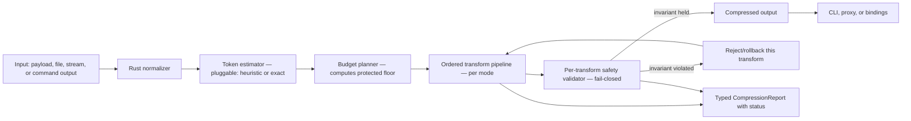
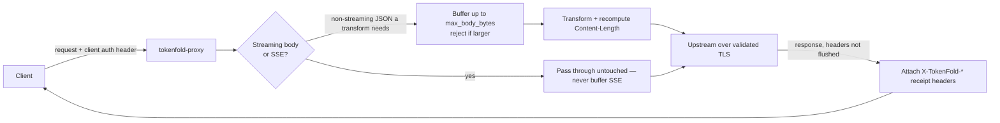

# High-Performance Token Compression Package Plan

> **For agentic workers:** REQUIRED SUB-SKILL: Use superpowers:subagent-driven-development (recommended) or superpowers:executing-plans to implement this plan task-by-task. Steps use checkbox (`- [ ]`) syntax for tracking.

**Goal:** Standalone, provider-neutral token and context compression for LLM apps, agents, proxies, and CLIs — cuts token cost without silently degrading model output, and can prove it.

**Architecture:** Rust-first core + CLI first; HTTP proxy and Python binding are optional follow-ons. Python owns the fidelity harness, not the runtime.

**Tech Stack:** Rust workspace + Cargo, `serde_json` (`preserve_order`), clap (derive), criterion + divan, optional axum/hyper proxy, optional pyo3/maturin, optional tree-sitter (feature-gated), `tiktoken-rs`/`huggingface/tokenizers`/Anthropic `count_tokens` API as pluggable exact estimators. Solo/open-source project (resolved 2026-07-11, see roadmap.md D-003): publish directly to public crates.io and PyPI — no internal Artifactory mirror.

## First Consumer & Success Definition

Before writing code, name the target and the outcome. A provider-neutral engine can still be validated against one real payload path first — that is the fastest route to proof and adoption.

- [x] **Entry gate, before Task 1:** Fill this worksheet and get an owner to sign off. Do not scaffold crates until the entry gate is complete. *(Signed off 2026-07-11 — solo project, no separate approver; see roadmap.md D-002.)*

| Field | Required value |
| --- | --- |
| Workload name | Dogfooding tokenfold on its own dev workflow: compressing `git diff` output and command/build/test logs fed to a coding agent during tokenfold's own development. |
| Owner | Project author (sole owner/maintainer). |
| Current monthly volume | None yet — pre-launch, no measured baseline. Establish from the first week of dogfooding once `tokenfold wrap` exists. |
| Dominant payload types | (1) `git diff` output, (2) plain-text command/CLI output (build/test/lint logs), (3) OpenAI-compatible JSON tool-call payloads from agent sessions. Matches the "Narrow" option in roadmap.md D-004. |
| Quality metric | Task completion: does the coding agent still produce a correct patch/response after compression, checked by manual spot-comparison against the uncompressed baseline (no formal downstream eval harness exists yet). |
| Target outcome | >=25% fewer exact tokens on dogfooding fixtures with no observed loss of critical diff/log content on manual review. |
| Fixture source | Sampled from tokenfold's own git history (diffs) and local build/test/lint output; scrub before use even though this is a solo repo. |
| Adoption path | Local CLI hook — wrapping the author's own dev commands (`git diff`, `cargo test`, `cargo build`) with `tokenfold wrap` during agent-assisted coding sessions. |

- [x] **Identity decision:** Default to **personal/internal tool first**. Public registry publishing (crates.io/PyPI) is allowed per roadmap.md D-001/D-003 since this is a solo/open-source project, but broader open-source positioning (README marketing, community support, D-010 license/OSS-release decision) stays out of scope until this first workload meets the target outcome.

## Executive Recommendation

Build a Rust-native compression engine with these release targets:

1. **v0.1 core library:** exact token accounting, budget planning, protected-content extraction, safety validation, typed reports, and the narrow transform set needed by the first consumer.
2. **v0.1 CLI:** inspect, compress, diff, benchmark, `wrap <cmd>` (alias `shell`), stdin/stdout modes, and installable static binaries.
3. **v0.1 fidelity harness skeleton:** enough paired original/compressed evaluation to block unsafe lossy defaults for the first consumer.
4. **v0.2 HTTP proxy:** optional transparent compression for OpenAI-compatible and Anthropic-compatible payloads after CLI/core semantics stabilize.
5. **v0.2 Python binding:** optional wheel for Python teams after the Rust report/status/error API stabilizes. The Python **fidelity harness is v0.1**, but the Python package is not.
6. **v0.2 portable-parity surfaces:** MCP server, reversible local retrieval, stats/ledger, and declarative command filters. These close Headroom/RTK adoption gaps while staying inside the static-binary model.
7. **v0.3+ full Headroom parity extensions:** framework adapters, RAG/vector routing, output-shaping holdouts, image/multimodal compression, learn/session mining, auth/update/admin commands, and optional dashboard surfaces. These ship as optional packages or sidecars so the core binary remains dependency-light.
8. **Future bindings:** Node, WASM, and Go wrappers only after the Rust API stabilizes and a first consumer requires them.

**Positioning (re-anchored, corrected July 2026).** The buyer does not feel a 40 ms compression pre-pass in front of a multi-second LLM call — latency is table stakes, not the product thesis. The competitive landscape has three lanes: fast CLI/hook tools (RTK, squeez, skim) for **command output only**; Python research tools (LLMLingua, ACON, kompact) that prove downstream quality; and a new **context-compression-layer** lane (`headroom`) with library, proxy, MCP server, agent-wrap, reversible retrieval, and published benchmark numbers.

> **Revised positioning:** `headroom` now occupies most of the "quality floor + multi-surface" space. The sharper position is: Headroom feature coverage with a portable Rust default path, typed safety reports, exact accounting, reversible local evidence, and downstream quality gates. Rust earns its place on **single-binary portability, zero-runtime-deps, and embeddability** — not on a latency win.

The package should compete on **validated dollars-saved-per-quality-point and portability**, not on latency. It should not start as a Python package if a portable single-binary is a primary requirement — but the *quality-defining* work stays in Python (see Language Decision).

## Research Summary

> All eleven projects below were verified to exist as of July 2026; none are fabricated. Claimed reduction numbers are the projects' own marketing and are reported here as claims, not independently verified facts. `headroomlabs-ai/headroom` was added in the July 2026 revision after it was found to occupy most of this plan's intended positioning (see Executive Recommendation).

### What The Market Shows

| Lane | Representative projects | Primary runtime | What it means |
| --- | --- | --- | --- |
| Fast CLI and agent hooks | `rtk-ai/rtk`, `claudioemmanuel/squeez`, `dean0x/skim` | Rust | Single-binary, command-aware compression is mostly Rust. All ship **prebuilt binaries** — a distribution model this plan must match. |
| **Context-compression layer (multi-surface)** | **`headroomlabs-ai/headroom`** | **Python CLI/proxy/library + TS SDK + Rust/PyO3 core pieces** | **The closest competitor to this plan's full vision. Ships library + proxy + MCP server + agent-wrap/init + reversible retrieval + stats/dashboard + output-shaping paths with published quality claims. Optional ML/vector/image dependencies make it broad but not a single static binary.** |
| Gateway or proxy compression | `edgee-ai/edgee`, `npow/kompact` | Rust or Python | Rust favored when gateway performance is the product; Python when the proxy emphasizes iteration and evaluation. |
| Research prompt compression | `microsoft/LLMLingua`, `microsoft/acon` | Python | ML experiments and papers — **and the source of the field's evaluation methodology** (downstream task quality), not a systems-architecture model. |
| Tokenization infrastructure | `huggingface/tokenizers`, `openai/tiktoken` | Rust core with language bindings | Fast tokenization uses a native (Rust) core under a convenient language surface — the precedent for this plan's pyo3 strategy. |
| General AI gateways | `BerriAI/litellm` | Python | Python wins on provider integrations and ergonomics, not raw text-processing speed. |

### Representative Metadata (Verified, With Corrections)

| Project | Verified notes | Design takeaway |
| --- | --- | --- |
| `rtk-ai/rtk` | Source-reviewed July 2026 as a Rust single-binary CLI (`Cargo.toml` observed at version `0.42.4`). Compresses **command/CLI output only**, not prompts/schemas. Architecture is broad command-family modules plus declarative TOML filters, captured/streamed runner modes, a `never_worse` guard, durable per-host init/rewrite hooks, local SQLite analytics (`gain`, `discover`, `session`), `verify`/trust-style filter workflows, and broad release packaging (prebuilt binaries/checksums/package formats). **No downstream quality/fidelity evaluation was visible in reviewed surfaces.** | Strong signal for Rust CLI ergonomics: thin hooks that delegate to the binary, byte-restorable init/uninit, declarative filter packs before 100+ hardcoded handlers, local stats/discover flows, and release packaging. Tokenfold adopts these via F-043, F-046, and F-047 while keeping exact tokenizers, typed `CompressionReport`, redaction, and downstream fidelity gates as differentiators. |
| `headroomlabs-ai/headroom` | **Verified July 2026. The most complete direct competitor.** Python CLI/proxy/library, TypeScript SDK, and Rust/PyO3 core pieces. Compresses JSON, source code (AST-aware), prose, images, tool outputs, RAG chunks, logs, and conversation history. Integration surfaces include library/adapters, proxy, MCP, durable agent integration, doctor/perf/dashboard/stats, output savings, learn/update, and auth/admin paths. Reversible CCR retrieval, KV-cache prefix stability, and output-token shaping/holdouts are present; published evals remain project claims unless independently reproduced. | **Occupies most of the "quality floor + multi-surface" space.** Tokenfold must plan support for every Headroom capability: CLI/proxy/MCP/init/retrieve/stats/filters in the portable path, and optional packs for adapters, RAG/vector, output shaping, image/multimodal, learn/session mining, auth/update/admin. Durable differentiators: portable static binary, fail-closed redaction, exact accounting, downstream fidelity gates. Full gap analysis in `TOUCHPOINTS.md`. |
| `edgee-ai/edgee` | Real Rust LLM gateway with compression derived from RTK (not independent corroboration). | **Treat as weak market evidence; cite `edgee-ai/edgee` explicitly.** |
| `claudioemmanuel/squeez` | Verified: Rust hook compressor across Claude Code, Copilot CLI, OpenCode, Gemini CLI, Codex CLI. On crates.io; **ships prebuilt macOS/Linux/Windows binaries; zero runtime deps.** | Cross-host hooks need a portable static binary **and prebuilt releases** — our distribution model. |
| `dean0x/skim` | Verified: Rust + tree-sitter, code-aware AST optimization across 17 languages, multiple reduction modes. | Code compression should use parser-aware Rust behind a feature flag. |
| `npow/kompact` | Python proxy, TF-IDF schema/extractive selection. Project-claimed BFCL deltas: Haiku -2.6%, Sonnet -3.9%, Opus -0.5%. | Feature inspiration and the benchmarking practice to emulate. |
| `microsoft/LLMLingua` | Verified: Python research, perplexity-based prompt compression. Evaluated by **downstream task metrics** (QA EM/F1, ROUGE, reasoning accuracy) at fixed ratios, not raw token ratio. | The evaluation methodology this plan adopts (see Fidelity Evaluation). |
| `microsoft/acon` | Verified: Python framework for long-horizon agents (arXiv:2510.00615). Cuts peak tokens 26-54% while **measuring agent task-completion** on AppWorld/OfficeBench. Its contrastive raw-succeeds/compressed-fails gate is the safety KPI we adopt. | Evaluation methodology + the contrastive-failure KPI. |
| `huggingface/tokenizers` | Verified: Rust core, Apache-2.0, pyo3/Node/Ruby bindings. | Real tokenizer for HF-format/Llama; native-core-with-bindings precedent. |
| `openai/tiktoken` | Verified: Rust `CoreBPE` core under a Python package (not a Python implementation). | Use `tiktoken-rs` (the Rust port) for exact OpenAI token counts. |
| `BerriAI/litellm` | Verified: Python SDK + proxy gateway, 100+ providers. | Python is effective at integration surfaces; pair with native hot paths for speed. |

**Methodology lesson:** every project that ships lossy compression responsibly proves safety by downstream task success — not token ratio alone. This plan's fidelity gate closes that gap.

## Language Decision

### Recommended: Rust Core (justified on portability, not latency)

Rust owns the compression engine because this package must be a **portable, embeddable single binary**.

Strengths:

- Static binaries for CLI, hooks, sidecars, containers, and local developer installs (the squeez/rtk distribution model).
- Fast text scanning, JSON handling, byte-level transforms — table stakes, and genuinely good.
- Memory safety without GC pauses; good concurrency for proxy/server mode.
- Strong ecosystem: `tiktoken-rs`, `huggingface/tokenizers`, tree-sitter, serde, SIMD, criterion/divan.
- Clean FFI/binding story via pyo3, napi-rs, WASM, or C ABI.
- Embeds in multiple hosts without forcing a Python runtime.

Risks (this is a high-magnitude, low-reversibility bet):

- The highest-value, most iteration-heavy work — the lossy semantic transforms (conversation memory, prose selection, code digest) — is owned by ML/research people who live in Python. Rust-first puts the engine where those contributors are least fluent.
- More up-front API-design discipline needed.
- Python wheels require maturin and platform build/release automation.

Mitigation (keep the reversible experimentation surface in Python):

- **Prototype and quality-gate every new lossy transform in the Python/research harness first**, where ML contributors iterate on quality against the fidelity benchmark. **Port only proven, stabilized algorithms into the Rust hot path.** This reserves the irreversible Rust commitment for settled algorithms.
- Keep the core API small; ship the CLI first; add Python bindings only after the Rust crate is stable; make contribution behavior obvious via examples and fixtures.

### Viable Alternative: Go Proxy/Daemon

Go is strong if the primary product becomes an HTTP sidecar/daemon (simple static binaries, excellent HTTP ecosystem, simple ops). Weaknesses: less compelling for parser/tokenizer-heavy library work; weaker cross-language binding story than Rust. **Decision:** do not choose Go for the first engine; revisit only if a long-running gateway becomes the primary surface and the Rust proxy proves too costly to operate.

### Not Recommended For Hot Path: Python

Python is weak for high-throughput text scanning, low-latency proxy mode, single-binary install, and multi-threaded CPU-bound transforms (GIL). **But it is the right home for the fidelity harness, transform prototyping, benchmark analysis, and neural-compression research.** If a Python API is required, it calls into Rust via pyo3/maturin — it is not a reimplementation.

## Product Scope

### In Scope For MVP

- Standalone provider-neutral compression engine (Rust core, stable typed API).
- CLI for local, pipe, hook, and CI workflows (stdin/stdout + `wrap <cmd>`, alias `shell`).
- **v0.1 transform wedge:** `json_minify`, `schema_compaction` (examples only; descriptions preserved), `log_compaction`, `diff_compaction` (changed line bodies kept), and mandatory `secret_redaction`. Add `table_compaction` only if the first-consumer worksheet names tables as a top-three payload type.
- Token-budget planner with **pluggable exact tokenizers** and a typed report/status model.
- Safety gates that **fail closed** — preserving protected facts, schema validity, tool descriptions, system/safety turns, latest user intent, earliest durable constraints, and reversible evidence markers.
- **A required downstream fidelity-evaluation harness** gating every lossy/policy-driven transform. *(Decision: this is a P0 release gate, not optional.)*
- Benchmark harness with fixtures, real-token accounting, latency, and bytes-allocated.
- Internal Artifactory dependency and artifact flow.
- **Prebuilt static binaries + install one-liner + `init`/`uninit`/`doctor` for the first supported agent host.** Manual snippets are documentation fallback, not the primary install path.

> **Sequencing:** the fidelity harness must land **before** `log_compaction`, `diff_compaction`, or any later lossy transform is enabled by default. Until the gate exists and passes, evidence-marked lossy transforms may exist behind `--experimental` only. Risky semantic transforms (`conversation`, `code_digest`, `prose_extraction`) are v0.2+ promotion candidates, not v0.1 deliverables.

### Out Of Scope For MVP

- Domain-specific SDK integration.
- Public PyPI or crates.io publishing.
- Neural summarization as a default transform.
- A required Python or Go runtime (Python bindings and harness are optional/dev-time).
- Cloud service dependency.
- Any savings claim without downstream-quality benchmark evidence.
- v0.1 default enablement for `conversation`, `code_digest`, `prose_extraction`, header-only `diff_compaction`, or provider-specific prompt rewriting.

### Full Headroom Parity Scope

The project now plans support for every Headroom capability, but splits that support by runtime cost:

| Capability group | Tokenfold support path | First planned version |
| --- | --- | --- |
| CLI pipe/compress/inspect/diff/wrap/benchmark | Rust static binary | v0.1 |
| Durable agent integration (`wrap`/`init`, `unwrap`/`uninit`, `doctor`) | Rust static binary with reversible host-config backups | v0.1 first host; v0.2 broader host set |
| Proxy | `tokenfold-proxy` Rust binary with strict streaming/pass-through and auth controls | v0.2 |
| MCP `tokenfold_compress`/`tokenfold_inspect`/`tokenfold_retrieve`/`tokenfold_stats` (+ opt-in `tokenfold_read`) | `tokenfold mcp serve` stdio server | v0.2 |
| Reversible retrieval / CCR analog | Local content-addressed evidence store; optional report/output markers | v0.2 |
| Stats/dashboard/perf/gain | Report-first `tokenfold stats`, optional loopback dashboard export | v0.2 |
| RTK-style command breadth | Declarative filter registry + `never_worse` guard before many Rust handlers | v0.2 |
| Python API | pyo3/maturin wheel over Rust core | v0.2 |
| TypeScript/Node/WASM bindings | Thin bindings after Rust API stabilizes | v0.3+ |
| Framework adapters | Optional adapter packages for OpenAI/Anthropic/Vercel AI SDK/LiteLLM/LangChain/Agno/ASGI/Strands as first consumers demand | v0.3 |
| RAG chunks and vector retrieval | Optional RAG/vector extension or sidecar; deterministic BM25/TF-IDF default, vector runtime opt-in | v0.3 |
| Output-token shaping and holdout measurement | Optional policy layer; reports separate input and output savings | v0.3 |
| Images/multimodal | Optional ML/multimodal extension; no default binary dependency | v0.3+ |
| Learn/session mining/auto-tuning | Privacy-preserving metadata mining; recommendations require explicit approval | v0.3 |
| Auth/update/admin commands | Internal release update checks, rollback, proxy/admin auth, provider credential doctoring without secret persistence | v0.3 |

**Constraint:** optional parity extensions must not make Python, ONNX, HuggingFace models, vector indexes, browser assets, or provider SDKs required for the v0.1/v0.2 CLI, hook, MCP, proxy, or core library path.

## Package Names

Working names to validate before implementation:

| Name | Pros | Risks |
| --- | --- | --- |
| `tokenfold` | Short, CLI-friendly, clear purpose. | Possible collision; **registry check still pending** — verify crates.io/PyPI/npm/GitHub. |
| `ctxzip` | Context-compression signal, short. | Several similarly named repos likely exist. |
| `context-squeeze` | Descriptive, agent-focused. | Nearby repo names raise collision risk. |
| `token-compress` | Plain and obvious. | Generic; likely registry collisions. |

Plan uses `tokenfold` as an internal codename only. **Before publishing an internal crate, binary artifact, Python wheel, or docs URL, complete registry + legal review and either approve `tokenfold` or rename everywhere before Task 1 creates package/module names.**

## Architecture

### Compression Pipeline



### Proxy Request/Response Flow (streaming by default)



### Core Components

| Component | Responsibility |
| --- | --- |
| `tokenfold-core` | Pure Rust engine: types, pluggable estimator, pipeline, per-transform safety, typed reports/status. |
| `tokenfold-cli` | CLI: inspect, compress, diff, benchmark, `wrap <cmd>` (alias `shell`), stdin/stdout, `--json`. |
| `tokenfold-proxy` | v0.2 optional HTTP proxy for OpenAI/Anthropic-compatible JSON; streaming pass-through by default. Ships as a separate binary, not a CLI subcommand. |
| `tokenfold-py` | v0.2 optional Python binding (pyo3/maturin, abi3 wheel). The v0.1 eval harness is pure Python tooling, not this package. |
| Benchmarks | Workspace `benches/` bench target (criterion + divan). *Not a separate crate* — the earlier `tokenfold-bench` crate label is dropped to match the repo layout. |
| Fidelity harness | Python-based eval harness (dev/CI only) — see Fidelity Evaluation. |

### Transform Types

Every transform has a **canonical stable ID** (used verbatim in reports, `X-TokenFold-*` headers, and `--disable`). Lossy transforms carry a **task-scope**: the task classes they are validated for.

**v0.1 availability:** default-enabled transforms are limited to the first-consumer wedge above. `secret_redaction` is a mandatory safety preprocessor, not a normal transform; it cannot be disabled by `--disable`. The only bypass is an explicit unsafe flag (`--unsafe-disable-redaction`) that emits a critical warning, writes an audit event, and is forbidden in proxy mode.

| Canonical ID | Display | Mode | Task-scope / notes |
| --- | --- | --- | --- |
| `json_minify` | JSON minify | Lossless | Strip insignificant whitespace only. **Never reorder keys** (requires `serde_json` `preserve_order`; reordering saves no tokens and busts provider prompt caches). |
| `schema_compaction` | Schema compaction | Semantics-preserving | Shorten examples while preserving names, required fields, enums, types, defaults. **Never shorten tool/function *descriptions* in conservative mode** (they encode security-relevant behavior contracts). |
| `log_compaction` | Log compaction | Lossy w/ evidence | Collapse runs → keep **first + last + count** (not just count); preserve relative ordering. Timestamp removal **opt-in, default off**. Only dedupes adjacent identical lines today — interleaved logs compress little (documented limitation). |
| `diff_compaction` | Diff compaction | Lossy w/ evidence | Keep file names, hunk headers, changed symbols, counts. **Keep changed +/- line bodies for code-review/patch consumers**; header-only form is valid only for change-summary consumers. |
| `code_digest` | Code digest | Lossy w/ evidence | Tree-sitter signatures/imports/public API/doc headers. **Validated for API-overview/navigation only; disallowed/downgraded for debugging/generation.** Behind a Cargo feature (needs a C toolchain). |
| `conversation` | Conversation history | Policy-driven | Structured extractive memory (decisions, constraints, entities, open tasks, IDs) — not free-form summary. Preserve earliest durable goal/constraint turns and the system/safety turns; cap compaction depth; never re-summarize a summarized block. |
| `prose_extraction` | Prose extraction | Lossy w/ evidence | Query/task-aware BM25/TF-IDF selection. Coreference-safe unit selection; never split a negation from its clause. |
| `table_compaction` | Table compaction | Semantics-preserving where possible | Keep headers, row counts, sampled rows, min/max/null summaries. |
| `secret_redaction` | Secret redaction | Safety transform | Runs before any observability/persistence boundary (see Security Model). Linear-time regex engine only. Best-effort → emits an `unredacted_content_possible` warning. |

## Token Counting Strategy

Accurate token counts are the unit every savings claim and budget decision depends on. The plan defines a `TokenEstimator` trait with a fast heuristic default and **pluggable exact backends selected per input format**.

- **Heuristic (`ByteHeuristicEstimator`, bytes/4):** fast pre-filter only. It tracks English prose (~4 chars/token) but **under-counts code/JSON/schema payloads — this package's core targets — by 10-30%+** (punctuation, quotes, braces, and indentation each become tokens). Under-counting is *anti-conservative* for a budget planner: it believes it is under budget when it is over. For dense formats it rounds up. It is **never** used for a published benchmark number or a final budget decision.
- **Exact backends (required for budget decisions and benchmarks):**
  - OpenAI → `tiktoken-rs` (`o200k_base`, `cl100k_base`).
  - HF-format / Llama → `huggingface/tokenizers` (`Tokenizer::from_file`/`from_pretrained`).
  - Anthropic/Claude → **there is no public Claude tokenizer**; use Anthropic's `/messages/count_tokens` API (also on Bedrock). Do not approximate Claude with tiktoken (under-counts ~15-20%+).
- The public `compress()` facade selects the estimator through the policy/input. The lower-level `compress_with_estimator()`/`apply_transforms()` take `&dyn TokenEstimator` so tests, benchmarks, and offline CI can inject deterministic estimators — the seam is not welded shut.
- Every report names the tokenizer + model version used, and marks whether numbers are heuristic or exact.
- **Exact-backend fallback:** exact counting has a hard timeout, named credential source, and fixture-token cache. CI uses cached exact counts or a deterministic mock estimator; release benchmarks must refresh exact counts. If an exact backend is unavailable during normal CLI use, the command either fails closed for budget decisions or proceeds with heuristic counts only when the user passes `--allow-heuristic-budget`, and the report/header says `heuristic`.

## Compression Modes Contract

Modes are the primary user-facing safety dial (library, CLI `--mode`, proxy `X-TokenFold-Mode`). They must mean the same thing everywhere.

| Mode | Transforms enabled | Per-transform ratio caps | Losses permitted |
| --- | --- | --- | --- |
| `Conservative` | Lossless + semantics-preserving only (`json_minify`, `schema_compaction` [examples only], mandatory `secret_redaction`) | Lossless: none; semantics-preserving: capped so validated downstream loss ≤ tolerance | No lossy content loss; tool descriptions and system/safety turns preserved byte-for-byte. |
| `Balanced` (**default**) | Conservative + fidelity-gated evidence-marked lossy (`log_compaction`, `diff_compaction` [bodies kept]) | Per-transform safe default ratio from the accuracy@ratio curve | Reversible/evidence-marked losses only. No semantic extraction in v0.1. |
| `Aggressive` | Balanced + promoted task-scoped lossy transforms only after fidelity approval | Higher caps; still gated by the fidelity harness | Task-scoped lossy losses; requires `TaskScope` compatibility and opt-in for security-bearing fields. |

Each mode's exact enabled-transform set and ratio caps are a **tested table**, tied to the transform IDs above, so "aggressive" is a precise, testable definition — not a label. The table lives in `crates/tokenfold-core/src/modes.rs` and is mirrored by `tests/fixtures/mode_matrix.toml`; CLI, proxy, and Python surfaces assert against that same matrix.

## Determinism & Transform Versioning

"Deterministic transforms" is a **tested contract**, not a wish.

- Enable `serde_json` `preserve_order` (indexmap); preserve input key order byte-for-byte. Forbid `HashMap`-iteration-order in any transform output.
- Add **cross-platform golden byte-equality tests** to the release gates (same input → same bytes on macOS/Linux/Windows, x86_64/arm64).
- **Every transform carries a semantic version.** `TransformReport` records `{ id, version, ... }`, and the `CompressionReport` header records the engine + transform-version set. Any behavior change is a transform-version bump, documented in CHANGELOG. The policy/proxy can **pin** transform versions so a proxy binary upgrade is an explicit, reviewable change — not silent drift that busts prompt caches and alters every downstream model call.

## Error Taxonomy

`TokenFoldError` is the error type of the crate's central fallible operations and dictates CLI exit codes, proxy HTTP status mapping, and Python exception mapping. `UnreachableTarget` is **not** a Rust error: compression returns `Ok(CompressionOutput)` with `Status::UnreachableTarget` plus `CompressionReport.budget`, because the output is usable best-effort content plus typed budget details. `INTERFACES.md §1.4` is authoritative for exit codes; the table below mirrors it.

| Outcome | Meaning | CLI exit | Proxy status | Python binding |
| --- | --- | --- | --- | --- |
| Success / `Status::Compressed` | Target met after compression | 0 | 200 + `X-TokenFold-Status: compressed` | returned status |
| `Status::Passthrough` | Under budget or no safe transforms changed output | 0 | 200 + `X-TokenFold-Status: passthrough` | returned status |
| `Status::BestEffort` | Improved output, target not fully reached | 0 | 200 + `X-TokenFold-Status: best_effort` | returned status |
| `Status::UnreachableTarget` | Target < protected floor; returns best-effort | 0 | 200 + `X-TokenFold-Status: unreachable_target` | returned status; optional helper raises `UnreachableTarget` |
| `InvalidInput` | Parse/format failure (bad JSON, non-UTF-8, invalid flag) | 2 | 400 | `InvalidInputError` |
| `SafetyViolation` / `RedactionFailed` | A protection/redaction invariant could not be met | 3 | 422 | `SafetyError` |
| `EstimatorError` | Exact tokenizer/API unavailable or token count failed | 4 | 503 | `EstimatorError` |
| `ConfigError` | Invalid `tokenfold.toml`, unknown field, invalid mode | 5 | 500 | `ConfigError` |
| `InternalError` / `Io` | Unexpected panic or I/O failure | 6 | 500 | `InternalError` / `OSError` |

`UnreachableTarget` is a **typed, first-class outcome**, not a magic string in `warnings`.

## Public Interfaces

> The Rust library, CLI, and Python examples below are **reconciled with the internal types** (the earlier draft's builder/string-mode/`openai_json()` examples disagreed with the scaffolded structs). Task 6/acceptance asserts every example here runs verbatim.

### Rust Library

```rust
use tokenfold_core::{compress, CompressionInput, CompressionPolicy, CompressionMode};

let policy = CompressionPolicy::builder()
    .target_tokens(12_000)
    .mode(CompressionMode::Balanced)
    .preserve_latest_user_message(true)
    .build()?;

// Format-specific constructor selects the default exact estimator (tiktoken o200k_base here).
let result = compress(CompressionInput::openai_json(payload), &policy)?;
println!("saved={} ({})", result.report.saved_tokens, result.report.estimator.backend);
match result.report.status {
    tokenfold_core::Status::UnreachableTarget => {
        if let Some(budget) = &result.report.budget {
            eprintln!("target below protected floor: floor={}, achieved={}", budget.protected_floor, budget.achieved_tokens);
        }
    }
    _ => {}
}
```

### CLI

```bash
# File in, compressed payload to stdout, human report to stderr:
tokenfold inspect payload.json --format openai --target-tokens 12000
tokenfold compress payload.json --format openai --target-tokens 12000 --mode balanced -o compressed.json

# Unix pipes / agent hooks — stdin with '-', payload to stdout, report to stderr:
git diff | tokenfold compress - --format text | pbcopy
tokenfold wrap -- git diff        # run the command, compress its output (`shell` is a visible alias)

# Machine-readable report only:
tokenfold inspect payload.json --format openai --json

tokenfold diff raw.txt compressed.txt      # compression-aware diff (see CLI Output spec)
tokenfold benchmark fixtures/*.json --format openai
```

Global flags: `--json`, `--no-color` (also honors `NO_COLOR`), `--quiet`, `--mode`, `--disable <ids>`, `--format`. `--disable secret_redaction` is rejected; the CLI-only escape hatch is `--unsafe-disable-redaction` and it is never allowed in proxy mode. Config precedence: **flags > env > `tokenfold.toml`/`.tokenfoldrc` > built-in defaults.**

### Proxy (v0.2 separate binary)

```bash
tokenfold-proxy \
  --listen 127.0.0.1:7878 \
  --upstream https://api.openai.com \
  --target-tokens 12000
```

Per-request **controls** (inbound):

```http
X-TokenFold-Disable: schema_compaction,log_compaction
X-TokenFold-Mode: conservative
X-TokenFold-Target-Tokens: 12000
```

Per-response **receipt** (outbound — the proxy's only discoverability channel):

```http
X-TokenFold-Applied: schema_compaction,log_compaction
X-TokenFold-Applied-Versions: schema_compaction@1.0.0,log_compaction@1.0.0
X-TokenFold-Original-Tokens: 18400
X-TokenFold-Compressed-Tokens: 11900
X-TokenFold-Savings-Pct: 35.3
X-TokenFold-Mode: balanced
X-TokenFold-Status: compressed          # compressed | passthrough | best_effort | unreachable_target
X-TokenFold-Estimator: tiktoken:o200k_base   # or heuristic
X-TokenFold-Format: openai_json
X-TokenFold-Request-Id: tc-7f3a2b1c
```

Only transforms with `TransformReport.status = "applied"` appear in `X-TokenFold-Applied`. Warnings stay in the JSON report, not response headers. Response headers must flush before a streamed body; document that they are omitted for streaming responses that flush headers first.

### Optional Python Binding (v0.2)

```python
from tokenfold import CompressionPolicy, CompressionMode, compress_openai_payload

result = compress_openai_payload(
    payload,
    policy=CompressionPolicy(target_tokens=12_000, mode=CompressionMode.BALANCED),
)
print(result.report.saved_tokens, result.report.estimator, result.report.status)
```

The Python package is a native binding over Rust, not a reimplementation. (The **fidelity harness** is separate pure-Python dev tooling — see Fidelity Evaluation.)

## CLI Output & UX Spec

The human-readable report is a headline deliverable. `INTERFACES.md` is the canonical contract for CLI, proxy, MCP, report JSON, and bindings.

- **Two modes:** human-readable **default**; `--json` emits the versioned `CompressionReport` to the stream defined by `INTERFACES.md`.
- **Stream contract:** compressed payload → **stdout**; human report → **stderr** (so `cmd | tokenfold | apply` is never corrupted). For `compress --json`, payload remains on stdout and report JSON goes to stderr. For `inspect --json`, the report goes to stdout because `inspect` emits no payload.
- **`tokenfold inspect payload.json --format openai --target-tokens 12000`** renders top-to-bottom:
  1. **Verdict line:** `OVER budget: ~18,400 → ~11,900 est. tokens (35.3% reduction, target 12,000) ✓ reachable` (green reachable / yellow best-effort / distinct UNDER-budget no-op line). Savings are rendered as a positive quantity (see `INTERFACES.md §2.2`).
  2. **Transform table:** right-aligned columns `TRANSFORM | MODE | EST TOKENS BEFORE→AFTER | SAVED | % | STATUS`; skipped rows dimmed with `skipped_reason` inline; thousands separators; a unit legend (`est. = bytes/4 heuristic`).
  3. **Totals row.**
  4. **WARNINGS block**, sorted by severity, colored glyphs (critical=red, warn=yellow), each with a code.
- **Honesty:** heuristic numbers are prefixed `~` and columns labeled `EST TOKENS`; the `~` and legend drop only when an exact backend was used. A `CompressionReport.estimator` struct (`estimator.backend` + optional `estimator.model`, e.g. `tiktoken` + `o200k_base`, `heuristic` with no model, or `anthropic` + `count_tokens`) is rendered on every surface. Never print a savings % without the estimator in the same view.
- **Empty/no-op states are designed.** Under budget: `UNDER budget: ~7,200 est. tokens ≤ target 12,000 — nothing to compress`, exit 0. **No target set is not a no-op:** `compress` runs the mode's transforms to their safe floor and reports real savings (the magical moment); `inspect` runs every transform in **dry-run** and previews achievable savings per transform (`No target set — showing max achievable savings per transform`), so `inspect` earns its name.
- **`diff` is a compression-aware diff**, not a generic text diff: header `raw ~18,400 → compressed ~11,900 est. tokens (35.3% reduction)`; unified body with removed regions dimmed and evidence markers highlighted (`[repeated 42x]`, `[hunk header kept, 210 body lines dropped]`); per-transform saved-token subtotals; `--json` for a structured hunk list; honors `NO_COLOR`/isatty.
- **Exit codes** per `INTERFACES.md §1.4`; actionable error messages (what failed, why, one fix); `--help`/usage for every subcommand.
- **`savings_ratio`** stays a fraction (`0.60`) in JSON/struct; `savings_pct` is a positive percent (`35.3`) for human/header surfaces. Human output renders `35.3% reduction` with one decimal and thousands-separated counts. Documented once so all surfaces match.
- **Typed warnings + status.** `warnings: Vec<Warning>` where `Warning { code: WarningCode, severity: Info|Warn|Critical, transform: Option<String>, message: String }`; and a top-level unit enum `status: Compressed | Passthrough | BestEffort | UnreachableTarget`. Budget details such as protected floor and achieved count live in `CompressionReport.budget`.

## Security Model

This package sits in the request path and handles credentials — security is scope, not an afterthought.

- **Credentials in transit.** Never log full request/response headers. Maintain a **loggable-header allowlist**; redact `Authorization`, `x-api-key`, `Cookie`, `Set-Cookie`, `Proxy-Authorization` by default before logs/reports/errors. Header redaction here is a **logging/reporting sanitizer**; it does not strip or rewrite credential headers that must be forwarded to the upstream provider. The body-only `secret_redaction` transform does not touch headers. Forbid raw header/body content in any report field (`warnings` included); document that reports are safe to persist. Test: no known-secret value appears in any log or report.
- **Redaction ordering (fail-closed).** Redaction MUST run **before the payload crosses any observability or persistence boundary** — logs, traces, metrics labels, error/panic messages, report snippets, and on-disk artifacts (`--output`). In the proxy, redact before the ingress access-log line is written, not just before the report. If redaction cannot run (undecodable body), **suppress the snippet** rather than emit raw. Proxy startup/config validation rejects `unsafe_disable_redaction = true` and the `--unsafe-disable-redaction` flag entirely.
- **Redaction engine.** Pin a **linear-time regex engine (Rust `regex`)**; forbid backtracking/PCRE crates in the redaction path (ReDoS). Combine pattern matching with high-entropy/base64 heuristics for enterprise/JWT/basic-auth-in-URL formats; treat redaction as **best-effort** and emit `unredacted_content_possible` so callers never over-trust "clean" output. Regression fixtures for enterprise key formats.
- **Body rewriting framing.** After any body-altering transform the proxy MUST **recompute `Content-Length`** (or switch to chunked and drop `Content-Length`), MUST **reject requests presenting both `Content-Length` and `Transfer-Encoding`**, and MUST strip hop-by-hop headers. Prevents CL.TE/TE.CL request smuggling and stream desync. Test: a compressed request has a single unambiguous framing header; conflicting-framing requests are rejected.
- **Resource limits (DoS).** Core fully materializes input/output as `Vec<u8>` and JSON transforms need the whole DOM. Define hard **`max_body_bytes`**, **`max_input_bytes`**, and **`max_json_depth`** defaults, reject or pass-through-uncompressed anything larger/deeper, **bound serde_json nesting depth + total allocation**, and cap total concurrent buffered bytes across proxy connections. Enforce at ingress before buffering. Document memory behavior as a security control.
- **Security-bearing content is protected.** Add **tool/function description text** and **system/safety turns** to the protected set by default: never shorten tool descriptions in conservative mode (opt-in for aggressive); never compress the system role or the first safety-bearing turn in conversation history. Golden fixtures assert these survive byte-for-byte; warn whenever any security-relevant field is altered.
- **Upstream TLS.** Require certificate validation on the upstream leg; reject `http://` upstreams unless an explicit, loudly-warned `--insecure-upstream` flag or `proxy.allow_insecure_upstream = true` config is set; consider optional cert pinning for known providers. Credential-bearing traffic never traverses an unvalidated TLS connection in production config.
- **Listener posture.** Bind loopback by default (`127.0.0.1`). The proxy is **pass-through auth** (the client supplies its own upstream credential; the proxy stores none and offers no per-request upstream-routing override — so classic SSRF/credential-drain is not exposed). Still: warn against binding non-loopback, and require an explicit opt-in before binding any non-loopback address.
- **Supply chain.** Add **blocking** release gates: `cargo audit` (RUSTSEC) and `cargo deny check advisories bans licenses sources`. Commit and verify `Cargo.lock`; the Artifactory index must **preserve upstream crate checksums**. Generate an **SBOM** (e.g. cargo-cyclonedx) per release. If the optional Python binding ships, publish **both sdist and wheels** with build provenance/attestation (e.g. Sigstore/PEP 740) and verify signatures on install.

## Fidelity / Output-Quality Evaluation (REQUIRED release gate)

> **Decision: this is a P0 release gate for every lossy/policy-driven transform, not optional research tooling.** It is the legitimate job of the Python/research layer. A lossy context transform can only be called "safe" by measuring the target model's downstream task success on the compressed context vs the original.

- **Harness.** For each `transform × mode × compression-ratio`, run a **fixed, version-pinned model** over paired original/compressed fixtures with known-correct answers and record a **task-level score**:
  - prose/schema/tool payloads → QA Exact-Match/F1;
  - summaries → ROUGE / answer-correctness;
  - conversation → agent task-completion (a fact from an OLD turn required to answer a LATE turn);
  - diffs → patch-regeneration / change-QA;
  - code digest → bug-find / behavior-QA.
- **Release gate:** ship a transform only if **downstream-score retention ≥ threshold (e.g. ≤2-5% absolute drop) at the shipped default ratio.** Not "saved_tokens > 0."
- **Headline safety KPI (ACON-style contrastive):** percentage of golden tasks that **pass on raw context but fail on compressed context** — target near-zero at the default mode. When a regression appears, an LLM analyzer attributes the loss to a specific transform, and that transform's policy tightens. This also sets the Conservative/Balanced/Aggressive boundaries empirically instead of by guessing.
- **accuracy@ratio curves.** Publish a per-content-type quality-vs-ratio curve and a **validated "safe default ratio" per transform**. Replace the flat targets ("50% on logs", "10-30% on schema") with these curves; bake the validated ratio band + expected downstream-score retention into `CompressionReport`.
- **Critical-token "needle" tests.** Inject known load-bearing tokens (paths, UUIDs, numeric thresholds, negations, error signatures) and assert **both** (a) survival in compressed output **and** (b) the model can still answer a question requiring that token. Report `critical_token_survival_rate` and `critical_token_answerability_rate` per transform. This upgrades "protected facts" from a static allow-list to a behavioral guarantee.
- **Production monitoring (proxy, design now even if it ships in v0.2).** Optional **fidelity-audit sampling mode**: on a fraction of traffic, score compressed-context vs raw-context model output with an LLM-as-judge faithfulness/relevancy metric (RAGAS/DeepEval/FaithJudge) and alert on drift. A monitoring signal complementary to the offline gate — never the only gate (judges are noisy; anchor releases on the labeled benchmark). The core report model carries the fields prod monitoring needs.
- **Round-trip / similarity** (ROUGE, embedding) are weak **secondary** signals only — high overlap routinely coexists with dropping the one load-bearing path/ID/negation that breaks the model.

## Repository Structure

```text
token-compression/
+-- Cargo.toml
+-- rust-toolchain.toml
+-- README.md            # quickstart FIRST: install one-liner, `git diff | tokenfold`, escape hatches
+-- CHANGELOG.md
+-- LICENSE.md
+-- deny.toml            # cargo-deny config (advisories, bans, licenses, sources)
+-- PLAN.md              # canonical spec/architecture doc
+-- ROADMAP.md           # canonical phases/features/decisions doc
+-- INTERFACES.md        # canonical CLI/report/proxy/Python/config contract
+-- ENGINEERING.md       # canonical testing/CI/risk/contributing doc
+-- TOUCHPOINTS.md       # canonical integration/competitive coverage doc
+-- .cargo/
|   +-- config.toml      # generated per-environment (see Internal Artifact Policy note)
+-- crates/
|   +-- tokenfold-core/
|   |   +-- Cargo.toml
|   |   +-- src/
|   |       +-- lib.rs
|   |       +-- budget.rs
|   |       +-- errors.rs
|   |       +-- input.rs
|   |       +-- modes.rs
|   |       +-- pipeline.rs
|   |       +-- report.rs
|   |       +-- retrieval_store.rs
|   |       +-- safety.rs
|   |       +-- status.rs
|   |       +-- stats.rs
|   |       +-- token_estimator.rs   # trait + heuristic + exact backends (feature-gated)
|   |       +-- filters.rs
|   |       +-- hooks.rs
|   |       +-- transforms/
|   |           +-- code_digest.rs   # behind `code-digest` feature (tree-sitter + C toolchain)
|   |           +-- conversation.rs
|   |           +-- diff.rs
|   |           +-- json.rs
|   |           +-- logs.rs
|   |           +-- prose.rs
|   |           +-- schema.rs
|   |           +-- tables.rs
|   |           +-- redaction.rs
|   +-- tokenfold-cli/
|   |   +-- Cargo.toml
|   |   +-- src/main.rs
|   +-- tokenfold-proxy/           # v0.2 optional
|   |   +-- Cargo.toml
|   |   +-- src/main.rs
|   +-- tokenfold-py/              # v0.2 optional binding; not the eval harness
|       +-- Cargo.toml
|       +-- pyproject.toml
|       +-- src/lib.rs
+-- benches/
|   +-- compression_bench.rs      # criterion (latency/throughput) + divan (bytes allocated)
|   +-- THRESHOLDS.toml
+-- eval/                         # Python fidelity harness (dev/CI only)
|   +-- pyproject.toml
|   +-- run_fidelity.py
|   +-- tasks/                    # labeled task sets per content type
|       +-- FIXTURES.md
+-- tokenfold.example.toml
+-- examples/
|   +-- openai_payload.json
|   +-- anthropic_payload.json
|   +-- logs.txt
|   +-- git_diff.txt
+-- tests/
    +-- fixtures/
    |   +-- mode_matrix.toml
    |   +-- reports/
    |   +-- filters/
    |   +-- openai_payloads/
    |   +-- anthropic_payloads/
    |   +-- command_outputs/
    |   +-- code/
    |   +-- logs/
    |   +-- conversations/        # multi-turn fixtures (old-turn fact needed late)
    |   +-- needles/              # critical-token survival fixtures
    +-- golden/                   # versioned, manifest'd byte-exact golden outputs
    +-- integration/
    +-- tokenfold-cli/
    +-- tokenfold-proxy/
```

## Internal Artifact Policy

Use internal Artifactory mirrors and registries for dependency resolution and publishing. The mirror **must preserve upstream crate checksums**.

Rust configuration example:

```toml
# .cargo/config.toml
# NOTE: cargo does NOT expand ${ENV_VARS} in config.toml. Either hard-code the
# index URL per environment or GENERATE this file from a template at setup time.
[source.crates-io]
replace-with = "internal-registry"

[source.internal-registry]
registry = "sparse+https://artifactory.internal.example/artifactory/api/cargo/cargo-remote/index/"

[registries.internal]
index = "sparse+https://artifactory.internal.example/artifactory/api/cargo/cargo-local/index/"
```

Rust install/build (always `--locked`):

```bash
cargo fetch --locked
cargo build --workspace --locked
cargo test  --workspace --locked
```

Rust publish internally:

```bash
cargo publish -p tokenfold-core --registry internal --locked
cargo publish -p tokenfold-cli  --registry internal --locked
```

Python binding configuration (single abi3 wheel per platform via maturin):

```bash
export PIP_INDEX_URL="$ARTIFACTORY_PYPI_SIMPLE_URL"
export UV_INDEX_URL="$ARTIFACTORY_PYPI_SIMPLE_URL"
export TWINE_REPOSITORY_URL="$ARTIFACTORY_PYPI_REPOSITORY_URL"
maturin build --release -m crates/tokenfold-py/pyproject.toml   # pyo3 features=["abi3-py39"]
python -m twine upload --repository-url "$TWINE_REPOSITORY_URL" target/wheels/*
```

Disallowed for project workflows:

```bash
cargo publish
pip install --extra-index-url https://pypi.org/simple some-package
python -m twine upload dist/*
```

## Distribution & Release (CI/CD)

The market thesis is "portable single binary." That claim is unproven until this exists.

- [ ] **Platform build matrix:** macOS (arm64, x86_64), Linux (x86_64-musl for static, aarch64), Windows (x86_64). Define the cross-compile/runner strategy.
- [ ] **Prebuilt static binaries** published to an internal Artifactory generic repo, each with a **checksum and signature**.
- [ ] **Install one-liner** and **copy-paste shell-hook snippets** per supported agent host (Claude Code, Copilot CLI, OpenCode, Gemini CLI, Codex CLI) in the README. "Download binary → drop into hook" is the T0 path; `cargo install` and the wheel are secondary.
- [ ] **Install mechanics:** define Artifactory path conventions, checksum/signature verification, macOS quarantine handling (`xattr -d com.apple.quarantine` when required), Windows PowerShell install, shell completions, `tokenfold --version`, rollback to a prior version, and no-network enterprise install steps.
- [ ] **Python wheel matrix (v0.2 only):** single abi3 wheel per platform via `maturin-action`; publish sdist + wheels with provenance/attestation.
- [ ] If any of this is deferred past v0.1, **say so explicitly** and note the "portable single binary" claim is unproven until then.

## Implementation Plan

### Task 1: Scaffold Rust Workspace

**Files:** `Cargo.toml`, `.cargo/config.toml`, `deny.toml`, `crates/tokenfold-core/{Cargo.toml,src/lib.rs}`, `crates/tokenfold-cli/{Cargo.toml,src/main.rs}`

- [ ] **Step 1: Workspace manifest** (members grow as crates are added; core + cli first).

```toml
[workspace]
resolver = "2"
members = ["crates/tokenfold-core", "crates/tokenfold-cli"]

[workspace.package]
version = "0.1.0"
edition = "2021"
rust-version = "1.81"
license = "Apache-2.0"
repository = "https://example.invalid/token-compression"

[workspace.dependencies]
serde = { version = "1", features = ["derive"] }
serde_json = { version = "1", features = ["preserve_order"] }   # never alphabetize keys
thiserror = "1"
regex = "1"
clap = { version = "4", features = ["derive"] }

# Exact estimators are feature-gated in tokenfold-core.
tiktoken-rs = { version = "0.7", optional = true }
tokenizers = { version = "0.20", optional = true }

# Test/benchmark dependencies used by workspace crates.
proptest = "1"
criterion = "0.5"
divan = "0.1"

# v0.2 optional surfaces; only enabled in their crates/features.
axum = { version = "0.7", optional = true }
hyper = { version = "1", optional = true }
pyo3 = { version = "0.22", optional = true }
```

Create `rust-toolchain.toml`:

```toml
[toolchain]
channel = "1.81"
components = ["rustfmt", "clippy"]
```

Create `deny.toml` with the redaction-path ReDoS guard:

```toml
[bans]
multiple-versions = "warn"

[[bans.deny]]
name = "fancy-regex"
reason = "Redaction must use Rust regex's linear-time engine; backtracking regex crates are forbidden."

[[bans.deny]]
name = "pcre2"
reason = "PCRE/backtracking regex is forbidden in token/redaction paths."
```

- [ ] **Step 2: Minimal core crate**

```rust
pub mod budget;
pub mod errors;
pub mod input;
pub mod pipeline;
pub mod report;
pub mod status;
pub mod token_estimator;

pub use errors::TokenFoldError;
pub use pipeline::compress;
pub use status::Status;
```

- [ ] **Step 3: Minimal CLI crate** — `fn main() { println!("tokenfold 0.1.0"); }`
- [ ] **Step 4: Validate** — `cargo fmt --all --check && cargo test --workspace --locked`. Expected: workspace builds and tests run.

### Task 2: Define Core Types, Reports, Status, and Errors

**Files:** `input.rs`, `report.rs`, `status.rs`, `errors.rs`

- [ ] **Step 1: Input/output types.** Note `CompressionOutput` derives **`PartialEq` only** (it contains `CompressionReport`, which contains `f64` — `Eq` would not compile).

```rust
use serde::{Deserialize, Serialize};

#[derive(Debug, Clone, Serialize, Deserialize, PartialEq, Eq)]
#[serde(rename_all = "snake_case")]
pub enum InputFormat { Auto, OpenAiJson, AnthropicJson, PlainText, CommandOutput, GitDiff }

#[derive(Debug, Clone, Serialize, Deserialize, PartialEq, Eq)]
pub struct CompressionInput { pub format: InputFormat, pub bytes: Vec<u8> }

impl CompressionInput {
    pub fn openai_json(bytes: impl Into<Vec<u8>>) -> Self {
        Self { format: InputFormat::OpenAiJson, bytes: bytes.into() }
    }
    pub fn anthropic_json(bytes: impl Into<Vec<u8>>) -> Self {
        Self { format: InputFormat::AnthropicJson, bytes: bytes.into() }
    }
}

#[derive(Debug, Clone, Serialize, Deserialize, PartialEq)] // NOT Eq: report holds f64
pub struct CompressionOutput { pub bytes: Vec<u8>, pub report: CompressionReport }
```

- [ ] **Step 2: Reports (typed status + typed warnings + estimator provenance + transform version).** This code mirrors `INTERFACES.md §2.3`; update both locations in the same PR.

```rust
use serde::{Deserialize, Serialize};

#[derive(Debug, Clone, Serialize, Deserialize, PartialEq)]
pub struct CompressionReport {
    pub schema_version: String,
    pub original_tokens: usize,
    pub compressed_tokens: usize,
    pub saved_tokens: usize,
    pub savings_ratio: f64,          // fraction: 0.353
    pub savings_pct: f64,            // positive percent: 35.3
    pub estimator: EstimatorInfo,
    pub status: crate::status::Status,
    pub mode: String,
    pub format: String,
    pub task_scope: String,
    pub request_id: Option<String>,   // required for proxy/MCP; optional for local CLI
    pub quality: Option<QualityReport>,
    pub budget: Option<BudgetReport>,
    pub cache: Option<CacheReport>,
    pub retrieval: Option<RetrievalReport>,
    pub output_savings: Option<OutputSavingsReport>,
    pub bypass: Option<BypassReport>,
    pub command: Option<CommandReport>,
    pub ledger: Option<LedgerReport>,
    pub transforms: Vec<TransformReport>,
    pub warnings: Vec<Warning>,
}

impl CompressionReport {
    pub fn new(
        original_tokens: usize, compressed_tokens: usize, estimator: EstimatorInfo,
        status: crate::status::Status, mode: String, format: String, task_scope: String,
        transforms: Vec<TransformReport>, warnings: Vec<Warning>,
    ) -> Self {
        let saved_tokens = original_tokens.saturating_sub(compressed_tokens);
        let savings_ratio = if original_tokens == 0 { 0.0 }
            else { saved_tokens as f64 / original_tokens as f64 };
        let savings_pct = savings_ratio * 100.0;
        Self { schema_version: "1.0".to_string(), original_tokens, compressed_tokens,
               saved_tokens, savings_ratio, savings_pct, estimator, status,
               mode, format, task_scope, request_id: None, quality: None,
               budget: None, cache: None, retrieval: None, output_savings: None,
               bypass: None, command: None, ledger: None, transforms, warnings }
    }
}

#[derive(Debug, Clone, Serialize, Deserialize, PartialEq)]
pub struct EstimatorInfo {
    pub backend: String,
    pub model: Option<String>,
    pub is_exact: bool,
}

#[derive(Debug, Clone, Serialize, Deserialize, PartialEq)]
pub struct BudgetReport {
    pub target_tokens: Option<usize>,
    pub protected_floor: usize,
    pub achieved_tokens: usize,
}

#[derive(Debug, Clone, Serialize, Deserialize, PartialEq)]
pub struct QualityReport {
    pub eval_profile_id: String,        // benchmark/eval profile that justified transform defaults
    pub task_scope: String,             // e.g. "code_review", "change_summary", "retrieval_qa"
    pub validated_ratio_band: Option<String>,
    pub quality_retention: f64,   // fraction, e.g. 0.975
    pub contrastive_failure_rate: f64, // raw succeeds, compressed fails
    pub gate_passed: bool,
}

#[derive(Debug, Clone, Serialize, Deserialize, PartialEq)]
pub struct TransformReport {
    pub id: String,             // canonical transform ID
    pub version: String,        // semantic transform version
    pub tokens_before: usize,
    pub tokens_after: usize,
    pub saved_tokens: usize,
    pub savings_ratio: f64,
    pub elapsed_micros: Option<u64>,
    pub status: TransformStatus,
    pub skipped_reason: Option<SkippedReason>,
    pub warnings: Vec<Warning>,
}

#[derive(Debug, Clone, Serialize, Deserialize, PartialEq, Eq)]
#[serde(rename_all = "snake_case")]
pub enum TransformStatus { Applied, NoOp, Skipped, RolledBack }

#[derive(Debug, Clone, Serialize, Deserialize, PartialEq, Eq)]
#[serde(rename_all = "snake_case")]
pub enum SkippedReason { TargetAlreadyMet, NotApplicableToFormat, NotEnabledInMode, ExperimentalFlagRequired, DisabledByUser, WouldIncreaseTokens, FilterUntrusted, FilterFailedVerify, BypassEnvSet, UnsupportedCommandShape, PipeOrHeredocNotRewritten, BinaryOutputDetected, UnsafeCommandPassthrough }

#[derive(Debug, Clone, Serialize, Deserialize, PartialEq, Eq)]
pub struct Warning {
    pub code: WarningCode,
    pub severity: Severity,
    pub transform: Option<String>,
    pub message: String,
}

#[derive(Debug, Clone, Serialize, Deserialize, PartialEq, Eq)]
#[serde(rename_all = "snake_case")]
pub enum Severity { Info, Warn, Critical }

#[derive(Debug, Clone, Serialize, Deserialize, PartialEq, Eq)]
#[serde(rename_all = "snake_case")]
pub enum WarningCode { UnreachableTarget, UnredactedContentPossible, SafetyDowngrade, SecurityFieldAltered, HeuristicBudgetUsed, PrefixModified }

#[derive(Debug, Clone, Serialize, Deserialize, PartialEq)]
pub struct CacheReport { pub boundary_kind: Option<String>, pub protected_bytes: usize, pub prefix_byte_identical: bool, pub warnings: Vec<Warning> }

#[derive(Debug, Clone, Serialize, Deserialize, PartialEq)]
pub struct RetrievalReport { pub store_namespace: String, pub hash_algorithm: String, pub marker_count: usize, pub ttl_seconds: Option<u64>, pub persisted_original_bytes: usize, pub skipped_original_bytes: usize }

#[derive(Debug, Clone, Serialize, Deserialize, PartialEq)]
pub struct OutputSavingsReport { pub profile: String, pub estimated_output_tokens_saved: Option<usize>, pub measured_output_tokens_saved: Option<usize>, pub provenance: String }

#[derive(Debug, Clone, Serialize, Deserialize, PartialEq, Eq)]
pub struct BypassReport { pub reason: String, pub source: String }

#[derive(Debug, Clone, Serialize, Deserialize, PartialEq)]
pub struct CommandReport { pub command_family: Option<String>, pub child_exit_code: Option<i32>, pub duration_ms: u64, pub raw_output_bytes: usize, pub stdout_bytes: usize, pub stderr_bytes: usize, pub stderr_mode: String, pub stderr_truncated: bool, pub compressed_output_bytes: usize, pub filter_pack_id: Option<String>, pub filter_version: Option<String>, pub never_worse_applied: bool, pub bypass_reason: Option<String> }

#[derive(Debug, Clone, Serialize, Deserialize, PartialEq)]
pub struct LedgerReport { pub recorded: bool, pub scope: Option<String>, pub project_hash: Option<String>, pub record_id: Option<String> }
```

- [ ] **Step 3: Status.**

```rust
#[derive(Debug, Clone, Serialize, Deserialize, PartialEq, Eq)]
#[serde(rename_all = "snake_case")]
pub enum Status {
    Compressed,
    Passthrough,
    BestEffort,
    UnreachableTarget,
}
```

- [ ] **Step 4: Error taxonomy** (drives CLI exit codes, proxy status, Python exceptions — see Error Taxonomy table).

```rust
#[derive(Debug, thiserror::Error)]
pub enum TokenFoldError {
    #[error("invalid input: {0}")] InvalidInput(String),
    #[error("safety violation: {0}")] SafetyViolation(String),
    #[error("redaction failed: {0}")] RedactionFailed(String),
    #[error("estimator error: {0}")] EstimatorError(String),
    #[error("config error: {0}")] ConfigError(String),
    #[error("internal error: {0}")] InternalError(String),
    #[error("io error: {0}")] Io(#[from] std::io::Error),
}
```

- [ ] **Step 5: Tests** — report math (use `f64::EPSILON`-tolerant compare or compare rounded); status serialization; quality report serialization; status/error → CLI exit-code mapping table. `cargo test -p tokenfold-core report status errors`.

### Task 3: Token Estimation And Budget Planning

**Files:** `token_estimator.rs`, `budget.rs`

- [ ] **Step 1: Trait + heuristic.** The heuristic is honestly labeled and rounds up for dense formats.

```rust
pub trait TokenEstimator {
    fn info(&self) -> EstimatorInfo;           // for report provenance
    fn count_bytes(&self, bytes: &[u8]) -> usize;
}

#[derive(Debug, Clone, Copy, Default)]
pub struct ByteHeuristicEstimator;             // fast pre-filter ONLY; under-counts dense JSON/code

impl TokenEstimator for ByteHeuristicEstimator {
    fn info(&self) -> EstimatorInfo {
        EstimatorInfo { backend: "heuristic".to_string(), model: None, is_exact: false }
    }
    fn count_bytes(&self, bytes: &[u8]) -> usize {
        if bytes.is_empty() { 0 } else { bytes.len().div_ceil(4) }
    }
}
```

- [ ] **Step 2: Exact backends (feature-gated).** `TiktokenEstimator` (`tiktoken-rs`, OpenAI), `HfTokenizerEstimator` (`huggingface/tokenizers`, Llama/HF), `AnthropicApiEstimator` (calls `/messages/count_tokens` — no public Claude tokenizer). Selected per `InputFormat` or via policy.
- [ ] **Step 3: Budget policy (builder, enum mode, preserve flag, estimator selection).**

```rust
#[derive(Debug, Clone, PartialEq, Eq)]
pub struct CompressionPolicy {
    pub target_tokens: Option<usize>,
    pub reserve_output_tokens: usize,
    pub mode: CompressionMode,
    pub task_scope: TaskScope,
    pub cache_boundary: Option<CacheBoundary>,
    pub preserve_latest_user_message: bool,
    pub disabled: Vec<String>,           // canonical transform IDs; cannot include secret_redaction
    pub unsafe_disable_redaction: bool,  // CLI-only escape hatch, rejected by proxy startup/config validation
}

#[derive(Debug, Clone, Copy, PartialEq, Eq)]
pub enum CompressionMode { Conservative, Balanced, Aggressive }

#[derive(Debug, Clone, Copy, PartialEq, Eq)]
pub enum TaskScope { All, General, CodeReview, ChangeSummary, Debugging, Generation, ApiOverview, RetrievalQa, AgentHistory }

#[derive(Debug, Clone, Copy, PartialEq, Eq)]
pub enum CacheBoundary { ByteOffset(usize), TurnIndex(usize) }

impl CompressionPolicy {
    pub fn builder() -> CompressionPolicyBuilder { CompressionPolicyBuilder::default() }
}
// CompressionPolicyBuilder: target_tokens(), mode(), task_scope(), cache_boundary(), preserve_latest_user_message(), disable(), unsafe_disable_redaction(), build() -> Result<_,TokenFoldError>
```

- [ ] **Step 4: Floor computation** — `budget::protected_floor(input, policy, estimator) -> usize` = tokens(protected + structurally-required content). Used to detect `UnreachableTarget`.
- [ ] **Step 5: Protected-content extractors.** Implement and fixture-test extraction rules per `InputFormat`: OpenAI messages, Anthropic messages, tool schemas, plain text, command output, and diffs. These extractors are the only inputs to `protected_floor`, so the floor is testable rather than interpretive.
- [ ] **Step 6: Tests** — heuristic rounding (`div_ceil`), exact-backend token counts on known fixtures or cached exact counts, offline exact-backend fallback behavior, floor computation, `default mode == Balanced`, redaction cannot be disabled through `disabled`. `cargo test -p tokenfold-core token_estimator budget`.

### Task 3.5: Fidelity Gate Contract And Mode Matrix

**Files:** `crates/tokenfold-core/src/modes.rs`, `tests/fixtures/mode_matrix.toml`, `eval/run_fidelity.py`, `eval/tasks/smoke/**`

- [ ] **Step 1: Mode matrix fixture.** Create a table mapping `mode × input_format × transform_id × default_ratio × disableability × task_scope × safety_gate`. CLI/proxy/Python tests must read the same table instead of duplicating mode definitions.
- [ ] **Step 2: Smoke fidelity harness.** Implement the minimal paired original/compressed runner for the first-consumer fixtures. It may use 20-50 labeled cases, but it must emit `quality_retention`, `contrastive_failure_rate`, and critical-token survival before any lossy transform becomes default-enabled.
- [ ] **Step 3: Gate behavior.** If the smoke gate is absent or failing, `log_compaction` and `diff_compaction` stay behind `--experimental`; `conversation`, `code_digest`, and `prose_extraction` remain unavailable.
- [ ] **Step 4: Validate.** `python eval/run_fidelity.py --gate --profile smoke-first-consumer`. Expected for Phase 2 exit: command exits 0 and emits a green JSON artifact with profile ID, model version, fixture hashes, total cost, and gate decision. A red artifact is useful evidence, but it does not satisfy the Phase 2 exit gate.

### Task 4: Deterministic Transforms (near-deterministic set first)

**Files:** `transforms/json.rs`, `transforms/logs.rs`, `transforms/schema.rs`, `transforms/diff.rs`, `transforms/redaction.rs`

- [ ] **Step 1: JSON minify (whitespace only, key order preserved).**

```rust
#[derive(Debug, thiserror::Error)]
pub enum JsonMinifyError {
    #[error("invalid json: {0}")] Invalid(#[from] serde_json::Error),
}

// Validate with serde_json, then strip insignificant whitespace lexically so
// duplicate keys, key order, string escapes, and number spelling are preserved.
pub fn minify_json(input: &[u8]) -> Result<Vec<u8>, JsonMinifyError> {
    serde_json::from_slice::<serde_json::Value>(input)?;
    let mut out = Vec::with_capacity(input.len());
    let mut in_string = false;
    let mut escaped = false;
    for &byte in input {
        if in_string {
            out.push(byte);
            if escaped { escaped = false; }
            else if byte == b'\\' { escaped = true; }
            else if byte == b'"' { in_string = false; }
        } else {
            match byte {
                b'"' => { in_string = true; out.push(byte); }
                b' ' | b'\n' | b'\r' | b'\t' => {}
                _ => out.push(byte),
            }
        }
    }
    debug_assert!(!in_string, "serde_json validation rejects unterminated strings before lexing");
    Ok(out)
}
```

- [ ] **Step 2: Log compaction (first + last + count; ordering preserved; timestamps opt-in).**

```rust
/// Collapse runs of adjacent identical lines, keeping first AND last plus a count.
/// LIMITATION: only adjacent duplicates; interleaved logs compress little (documented).
pub fn compact_repeated_lines(input: &str) -> String {
    let mut out: Vec<String> = Vec::new();
    let mut iter = input.lines();
    let Some(mut current) = iter.next() else { return String::new(); };
    let mut count = 1usize;
    for line in iter {
        if line == current { count += 1; }
        else {
            push_run(&mut out, current, count);
            current = line; count = 1;
        }
    }
    push_run(&mut out, current, count);
    out.join("\n")
}

fn push_run(out: &mut Vec<String>, line: &str, count: usize) {
    if count >= 2 {
        out.push(line.to_string());
        out.push(format!("[repeated {}x]", count));
        out.push(line.to_string()); // keep last occurrence too
    } else {
        for _ in 0..count { out.push(line.to_string()); }
    }
}
```

- [ ] **Step 3: Schema compaction** — shorten examples only; **preserve tool/function descriptions** (conservative) and names/required/enums/types/defaults.
- [ ] **Step 4: Mandatory secret redaction** — linear-time `regex` + entropy heuristics; emit `UnredactedContentPossible`; reject `--disable secret_redaction`; test the unsafe CLI-only bypass separately.
- [ ] **Step 5: Tests** — JSON byte-level preservation outside whitespace (duplicate-key fixture included), malformed/empty/non-UTF-8 inputs; log first+last+count; adjacent-only limitation documented in a test; diff body-preservation; redaction fixtures for enterprise key formats. `cargo test -p tokenfold-core transforms`.

### Task 5: Pipeline, Floor, Safety Gates (fail-closed)

**Files:** `pipeline.rs`, `safety.rs`

- [ ] **Step 1: `compress` + defined `apply_transforms` interface.**

```rust
pub fn compress(
    input: CompressionInput,
    policy: &CompressionPolicy,
) -> Result<CompressionOutput, TokenFoldError> {
    let estimator = crate::token_estimator::select_estimator(&input, policy)?;
    compress_with_estimator(input, policy, estimator.as_ref())
}

pub fn compress_with_estimator(
    input: CompressionInput,
    policy: &CompressionPolicy,
    estimator: &dyn TokenEstimator,    // selected per format/policy — abstraction not welded shut
) -> Result<CompressionOutput, TokenFoldError> {
    let original = estimator.count_bytes(&input.bytes);
    let target = policy.target_tokens; // Option — None means "compress to safe floor", NOT no-op

    if let Some(t) = target {
        if original <= t {
            let report = CompressionReport::new(
                original, original, estimator.info(), Status::Passthrough,
                policy.mode.as_str().into(), input.format.as_str().into(), policy.task_scope.as_str().into(),
                Vec::new(), Vec::new());
            return Ok(CompressionOutput { bytes: input.bytes, report });
        }
    }
    apply_transforms(input, policy, estimator, original, target)
}
```

`apply_transforms` contract: `secret_redaction` runs first and cannot be disabled. Then select the ordered transform list for `input.format`, `policy.mode`, and `policy.task_scope` (minus `policy.disabled`); apply each; **stop when the target is met or transforms are exhausted**. Compute `floor = protected_floor(...)`. When `target < floor`, **never drop protected content** — return the minimum achievable output with `Status::UnreachableTarget`, `CompressionReport.budget = Some(BudgetReport { target_tokens, protected_floor: floor, achieved_tokens })`, and a `WarningCode::UnreachableTarget`.

- [ ] **Step 2: Per-transform safety validation (fail-closed).** Validate **after each transform**, not just terminally. On a violated/unproven invariant: **reject or roll back that transform** (restore pre-transform bytes), record a `SafetyDowngrade` warning; only downgrade to a warning for explicitly reversible/evidence-marked losses. Invariants: JSON parseable after JSON transforms; latest user/task input preserved; earliest durable constraints preserved; tool/function **names and descriptions** preserved (conservative); system/safety turns preserved; required schema fields/enums/types/defaults intact; secret redaction ran before any snippet; determinism (no nondeterministic iteration order). For the proxy, a terminal safety failure means **forward the original untouched** rather than a corrupted payload.
- [ ] **Step 3: Tests** — `target < floor` fixture asserts protected content survives + `UnreachableTarget` emitted; safety rollback on a transform that would drop a required field; proxy fail-closed path. `cargo test -p tokenfold-core pipeline safety`.

### Task 6: CLI (stdin/stdout, wrap, json, modes, help, exit codes)

**Files:** `crates/tokenfold-cli/src/main.rs`

- [ ] **Step 1: Command surface reconciled with the documented examples.**

```rust
#[derive(clap::Parser)]
#[command(name = "tokenfold", version)]
struct Cli {
    #[arg(long, global = true)] json: bool,
    #[arg(long, global = true)] no_color: bool,
    #[arg(long, global = true)] quiet: bool,
    #[arg(long, global = true)] unsafe_disable_redaction: bool,
    #[arg(long, global = true)] experimental: bool,
    #[arg(long, global = true)] task_scope: Option<TaskScopeArg>,
    #[arg(long = "enable", global = true)] enable: Vec<String>,
    #[command(subcommand)] cmd: Command,
}

#[derive(clap::Subcommand)]
enum Command {
    /// Dry-run preview of achievable savings (previews per-transform even with no target).
    Inspect { input: Input, #[arg(long)] format: Option<Format>, #[arg(long)] target_tokens: Option<usize>, #[arg(long)] mode: Option<Mode>, #[arg(long)] list_transforms: bool },
    /// Compress; payload -> stdout, report -> stderr (or --json).
    Compress { input: Input, #[arg(short, long)] output: Option<std::path::PathBuf>, #[arg(long)] format: Option<Format>, #[arg(long)] target_tokens: Option<usize>, #[arg(long)] mode: Option<Mode>, #[arg(long)] disable: Vec<String>, #[arg(long)] dry_run: bool },
    /// Compression-aware diff of two payloads.
    Diff { raw: Input, compressed: Input },
    /// Run a command and compress its output (the rtk/squeez analog). `shell` is a visible alias; `exec` is hidden.
    #[command(visible_alias = "shell", alias = "exec")]
    Wrap { #[arg(trailing_var_arg = true)] argv: Vec<String> },
    Benchmark { fixtures: Vec<std::path::PathBuf>, #[arg(long)] format: Option<Format> },
    Init { #[arg(long)] agent: String, #[arg(long)] dry_run: bool },
    Uninit { #[arg(long)] agent: String },
    Doctor { #[arg(long)] agent: Option<String> },
}

// `Input` parses "-" (or absent) as stdin; otherwise a PathBuf. Config precedence: flags > env > tokenfold.toml > defaults.
```

- [ ] **Step 2: Output** — payload to stdout, human report to stderr. For `compress --json`, report JSON goes to stderr and payload remains on stdout; for `inspect --json`, report JSON goes to stdout because no payload exists. Honor `NO_COLOR`/isatty; render per the CLI Output & UX spec (verdict line, transform table, totals, typed warnings, exit codes).
- [ ] **Step 3: Validate — every documented example runs verbatim.**

```bash
cargo run -p tokenfold-cli -- inspect examples/openai_payload.json --format openai --target-tokens 12000
git diff | cargo run -p tokenfold-cli -- compress - --format text
cargo run -p tokenfold-cli -- wrap -- git diff
cargo run -p tokenfold-cli -- inspect examples/openai_payload.json --json
! cargo run -p tokenfold-cli -- compress examples/openai_payload.json --disable secret_redaction
```

Expected: reachable/under-budget verdicts render; stdin works; `wrap` (alias `shell`) compresses command output; `inspect --json` prints only the report; `compress --json` keeps payload on stdout and report JSON on stderr; exit codes match `INTERFACES.md §1.4`.

### Task 7: Benchmarks (real tokens, latency, bytes-allocated, reproducible)

**Files:** `benches/compression_bench.rs`, fixtures under `tests/fixtures/**` with a provenance manifest.

- [ ] **Step 1: criterion for latency/throughput; divan for bytes-allocated** (criterion cannot measure allocations).
- [ ] **Step 2: Every published number pins** tokenizer + version (exact, not heuristic), target model + version for any quality metric, fixture source/size/hash/license, mode, and config. Add a byte-identical reproduction command to the benchmark release section in `ENGINEERING.md` or `CHANGELOG.md`.
- [ ] **Step 3: Regression thresholds.** Define first-consumer gates: p95 latency, bytes allocated, exact-token savings, downstream-score retention, and contrastive failure rate. A release candidate fails if it regresses beyond the threshold without an explicit override note.
- [ ] **Step 4: Run** — `cargo bench --workspace`. Expected: per-transform latency, throughput, and bytes-allocated; a reproducible manifest.

### Task 8: Optional Proxy (v0.2 separate binary, streaming by default)

**Files:** `crates/tokenfold-proxy/{Cargo.toml,src/main.rs}`, `Cargo.toml`

- [ ] **Step 1:** Add the proxy crate only after core + CLI are stable. It ships as `tokenfold-proxy`, not `tokenfold proxy`. Build on **axum/hyper**: stream bodies frame-by-frame by default; **never buffer SSE/streaming responses**; buffer only the specific non-streaming JSON request bodies a transform must see whole (bounded by `max_body_bytes`). Recompute `Content-Length` (or chunk + drop it); reject `CL`+`TE`; strip hop-by-hop headers; validate upstream TLS; loopback default; attach `X-TokenFold-*` response headers; redact credentials before any log line.
- [ ] **Step 2: Validate with a local mock upstream.** `cargo test -p tokenfold-proxy`. Expected: untouched forwarding when compression disabled; compressed JSON when enabled; SSE passes through unbuffered; conflicting-framing requests rejected; no secret header value appears in logs.

### Task 9: Fidelity Harness (REQUIRED gate — build before shipping any lossy transform)

**Files:** `eval/run_fidelity.py`, `eval/tasks/**`, `eval/pyproject.toml`

- [ ] **Step 1:** Implement the paired original-vs-compressed task runner (QA EM/F1, ROUGE, agent task-completion, patch-regeneration, bug-find) with a pinned model, per `transform × mode × ratio`.
- [ ] **Step 2:** Define operating controls: provider/internal endpoint, credential source, max eval cost per run, timeout/retry policy, seed/version pinning, raw-output retention, data classification, PII/secret scan, and fixture approval workflow.
- [ ] **Step 3:** Emit accuracy@ratio curves, the **contrastive raw-passes/compressed-fails KPI**, and critical-token needle results. Gate: downstream-score retention ≥ threshold at the shipped default ratio.
- [ ] **Step 4:** Wire into CI as a **blocking release gate** for lossy/policy-driven transforms.

### Task 10: Optional Python Binding (v0.2)

**Files:** `crates/tokenfold-py/{Cargo.toml,pyproject.toml,src/lib.rs}`, `python-tests/test_binding.py`

- [ ] **Step 1: Bind Rust result types** (mode enum, estimator provenance, status) — implement the `INTERFACES.md §5` Python API: generic `compress()` and `inspect()` return `CompressionResult { payload, report }`, format-specific wrappers delegate to `compress()`, and enum names use Python `ALL_CAPS`.

```rust
#[pyfunction]
fn compress_text(py: Python<'_>, text: &str, target_tokens: Option<usize>) -> PyResult<PyObject> {
    let policy = CompressionPolicy::builder()
        .maybe_target_tokens(target_tokens)
        .mode(CompressionMode::Balanced)
        .build()
        .map_err(|e| pyo3::exceptions::PyValueError::new_err(e.to_string()))?;
    let input = CompressionInput { format: InputFormat::PlainText, bytes: text.as_bytes().to_vec() };
    let out = tokenfold_core::compress(input, &policy)
        .map_err(map_err)?;                 // maps TokenFoldError -> the right Python exception
    compression_output_to_py(py, out)       // returns bytes + report/status/warnings
}
```

- [ ] **Step 2: Build one abi3 wheel per platform** — `maturin build --release -m crates/tokenfold-py/pyproject.toml` (pyo3 `features=["abi3-py39"]`). Expected: a single wheel in `target/wheels` runs across Python ≥3.9.

### Task 11: Documentation And Release Gates

**Files:** `PLAN.md`, `ROADMAP.md`, `INTERFACES.md`, `ENGINEERING.md`, `TOUCHPOINTS.md`, `README.md`, `CHANGELOG.md`, `deny.toml`

- [ ] **Step 1: Quickstart first.** README leads with the install one-liner, the single most impressive zero-config command (`git diff | tokenfold`) with expected savings output, then escape hatches and per-host hook snippets. The five canonical planning docs record architecture, interfaces, security, benchmarks, artifact policy, compression modes, proxy behavior, and competitive coverage; do not create a separate docs tree unless the five-doc consolidation rule changes.
- [ ] **Step 2: Core v0.1 release gates (all blocking).**

```bash
cargo fmt --all --check
cargo clippy --workspace --all-targets -- -D warnings
cargo test --workspace --locked
cargo audit                                   # RUSTSEC advisories
cargo deny check advisories bans licenses sources
cargo bench --workspace
cargo build --workspace --release --locked
python eval/run_fidelity.py --gate --profile smoke-first-consumer
# cross-platform golden byte-equality + SBOM (cargo-cyclonedx) + artifact signing
```

- [ ] **Step 3: Optional surface gates (block only releases that include these crates).**

```bash
cargo test -p tokenfold-proxy --locked
maturin build --release -m crates/tokenfold-py/pyproject.toml
pytest python-tests
python -m twine check target/wheels/*
```

Expected: all core gates pass, including the fidelity smoke gate and supply-chain scans, before internal binary publishing. Optional surface gates block only releases that include those surfaces.

## Benchmark Requirements

Publish benchmark results per release. **Every number is in real tokenizer tokens (exact backend), never the bytes/4 heuristic**, and every quality number names its model + version.

Required content categories: large command output, git diff, test-failure logs, JSON payloads, tool/function schemas, code files, long prose / retrieval context, conversation histories (multi-turn), and needle fixtures.

Fixture compliance requirements: every real internal payload fixture must have data classification, license/source notes, PII/secret scan result, retention owner, and approval before it enters `tests/fixtures/**` or `eval/tasks/**`.

Metrics:

- Original / compressed / saved tokens (exact tokenizer, named) and savings ratio.
- **Downstream task score (original vs compressed) and score delta** per fixture category — the primary safety metric.
- **Contrastive KPI:** % of golden tasks that pass on raw context but fail on compressed context (target ~0 at default mode).
- **accuracy@ratio curve** and the **validated safe default ratio** per transform.
- Critical-token survival rate and answerability rate.
- Transform latency (µs) and end-to-end latency.
- Bytes allocated (divan).
- Safety warnings; parse/validation success.
- Provenance: tokenizer+version, model+version, fixture hash/source/license, mode, seed/config.

MVP performance targets (latency = table stakes, quality = the bar):

- Under 10 ms for common command outputs under 1 MB; under 50 ms for structured JSON under 2 MB (constraints, not the product thesis).
- Zero invalid JSON after JSON-mode transforms; JSON key order preserved byte-for-byte.
- Zero removal of protected facts, tool descriptions, or system/safety turns in golden fixtures.
- **Downstream-score retention ≥ threshold (e.g. ≤2-5% absolute drop) at each transform's shipped default ratio** — replaces the flat "50% on logs / 10-30% on schema" savings floors, which are now expressed as accuracy@ratio curves.

## Open Decisions

1. Final project + binary name (registry + legal review **still pending** — not yet verified this revision).
2. License model for any open-source release.
3. Internal Cargo registry URL and publishing permissions.
4. Internal Python wheel repository for the optional binding.
5. v0.1 first-class payload formats selected from the first-consumer worksheet. Default proposal: plain text/command output, git diff, and OpenAI-compatible JSON only.
6. Proxy is v0.2 unless the first consumer explicitly requires a request-path deployment.
7. `code_digest` is v0.2+ behind a Cargo feature after fidelity approval; v0.1 is text/diff only.
8. Threshold values for the fidelity gate (absolute score-drop tolerance) and the default ratio per transform.
9. Internal-cost-reduction-tool-first vs open-source-product identity (see First Consumer).

## Immediate Next Step

Complete the First Consumer worksheet, approve the internal codename/legal path, and lock the v0.1 payload formats. Then create the Rust workspace and run Task 1 with the narrowed release slice: **Rust core + CLI + exact accounting + mandatory redaction + first-consumer fidelity smoke gate first; optional proxy and Python binding later.**

